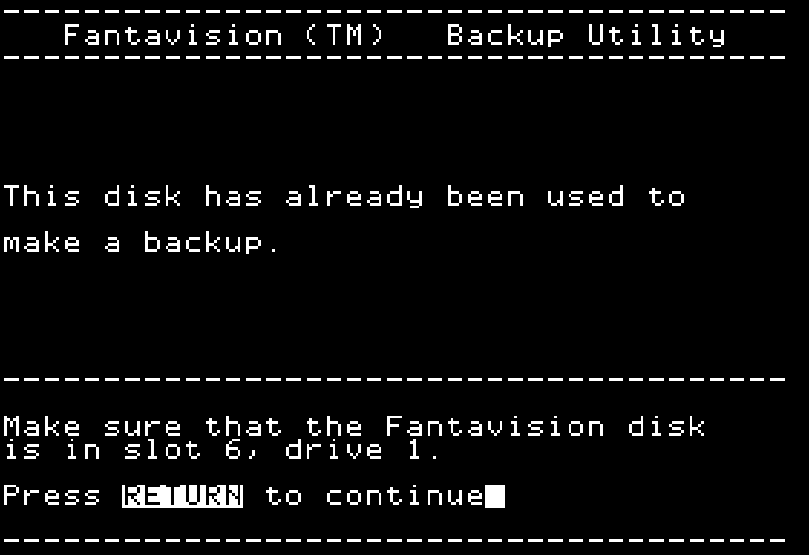

# Fantavision Reloaded

# Table of Contents

* Introduction
* Preparation
* ESC to Bug out
* Ye Olde Boot Tracing
  * P5 Boot PROM
* Boot Tracing Stage 1b
* RWTS
* Boot Tracing Stage 2
* Boot Tracing Stage 3
* Time to go Loco, er, Logo
  * Logo -- no, not the language
  * Logo 2
  * Logo 3 !
  * Logo 4 !!
* _"What this, **Byte-Code,** you say young chap?"_
  * Backup 1
  * Backup 2
  * Backup Byte-Code Interpreter
    * Backup 1 Disassembly
    * Backup 2 Disassembly
* Applesoft?!
  * Applesoft Tokens
* Boot Tracing Stage 5
* Boot Tracing Stage 6
  * Boot Stage Memory Map
* Disk Information
  * Notes
  * COPY, eh?
  * ProDOS Hybrid!?
  * ProDOS Block Review
  * Disk Usage Details
  * Disk Usage Summary
* Easter Eggs
  * Source Code
  * Original File Names
  * Deleted Files!?
* In Search of a Better Beep, or two

# Introduction

_"Get off my LAN, Grandpa"_

Before Macromedia's [Flash](https://en.wikipedia.org/wiki/Adobe_Flash)
became ubiquitous back in 1985 
[Brøderbund](https://en.wikipedia.org/wiki/Broderbund)
released a fantastic animation program called `Fantavision`

* 

* TODO: PIC: Disk

* TODO: PIC: Box

* TODO: PIC: Manual

Back then I had many unanswered questions about it:

* Where is the Logo stored on disk?
* Where are the (bitmap) icons stored in memory?
* How is the (mouse) cursor drawing code done?
* What is the movie file format?
* How is it copy-protected?
* How could we remove the copy-protection?
* How does the backup utlity know if a copy has been made?

Let's have some fun exploring these. Along the way we'll discover:

* Boot Tracing
* Learn HOW Fantavision is actually copy-protected
* Restore the "Backup Functionality" by writing an "UNBACKUP" program
* Use COPYA to copy it so we can inspect it with any Sector Editor
  * Trivially crack it
* Easter Eggs

Let's get started!


# Preparation

Before we get started, first a word from our sponsor, er, experience.

**WARNING:** _ALWAYS_ write-protect your **original disk** to prevent (accidental) mistakes from happening!

No, _I've_ never done that, but it is WAY too easy to make this mistake.
Take the 30 seconds (of insurance). You won't regret the peace of mind it will bring.

With that warning out of the way:

Let's create a blank DOS 3.3 data disk that we'll use to save our work-in-progress.

1. Boot your favorite "Fast" DOS such as ProntoDOS or Diversi-DOS.

2. Replace the disk with a blank floppy.

3. Enter these lines:

```
    NEW
    10 ?CHR$(4);"CATALOG"
    INIT HELLO
```

4. Remove it from the disk drive and label it as `Fanta.Work`


# ESC to Bug Out

You may or may not know that while Fantavision boots up
one can hold `ESC` down to enter the built-in backup utility!

Sadly, most originals will show this screen:

* 

What we want is this picture:

* 

Now my //e has 3 disk drives, two connected on Slot 6, and one on Slot 5.
For fun let's boot Fantavision from drive 5 and enter the backup utility.

We get the message:

```
Make sure that the Fantavision disk is in slot 5, drive 1
```

OK.

Pressing `RETURN` and it reboots from slot 6.  Whoops!
The programmer detected which slot it was started from but were lazy
and didn't properly "exit" (JMP) to the right slot.

If we were really bored we could write some boot sector tools
on the blank disk in slot 6 and "chain" reverse engineering
but let's take the more traditional approach.

# Ye Olde Boot Tracing

1. If you computer isn't already on, turn it on and press `CTRl-RESET`

2. Insert the original Fantavision disk in Slot 6, Drive 1

3. Type these instructions:

```
    CALL-151
    9600<C600.C6FFM
    96FA:1F
    1F01:00
    9600G
```

We end up with this "error" screen:

```
1F03-    A=01 X=60 Y=00 P=31 S=F0
*
```

Let's turn off that drive motor so we don't wear the drive (and disk) out.

```
    C0E8:1
```

We want to save this puppy so let's move the Boot Stage 1 to a safe place ...

```
    3800<800.8FFM
```

... and reboot with our `Fanta.Work` disk so we can save it.

I already have a work ProntoDOS disk in Drive 5 so I'll be using ...

```
    C500G
```

... but if you only have 1 drive you'll just need to flip disks more often.
Anytime you see `C500G` replace it with:

```
    C600G
```

Once we are back in DOS land we can save it.

```
    800<3800.38FFM
    BSAVE B1.FANTAVISION_T00S0_0800,A$800,L$100
```

Now that we have the boot sector saved let's tear into it and see what it is doing.
Now I could be a jerk and hand-wave it as

* _"Implementation Details"_ or the equally annoying
* _"Left as an Exercise for the Reader"_ 

but I'll be nice guy and provide a fully documented disassembly:

```asm
                    ; Disk Drive P5 PROM Usage ZP and IO
                            P5.Buff             = $26   ; 16-bit pointer to dest
                            P5.SlotX16          = $2B   ; i.e. $60 = Slot 6
                            P5.WantTrack        = $41   ;

                            P5.SecWant          = $3D   ;
                            P5.SecTotal         = $0800 ; T00S0 @ $00: total number of sectors to load

                            PHASE_MASK          = $03   ; 4 phases
                            PHASE0_OFF          = $C080
                            PHASE0_ON           = $C081

                            DRIVE_OFF           = $C088 ; Motor Off
                            DRIVE_ON            = $C089 ; Motor On
                            DRIVE_DATA          = $C08C

                    ; Globals
                            boot_HalfTrack_Seek = $50
                            boot_HalfTrack_Have = $51
                            NumSecLeft          = $52
                            BufZP               = $1000  ; Zero Page is saved here

                            rwts_SlotX16        = $FD
                            rwts_HalfTrack_Have = $FF    ;

                            ReadBoot3           = $B500
                            LoadBoot3           = $BC00
                            ExecBoot3           = $BE00

                    ; Misc.
                            RESET               = $3F2  ; Ctrl-Reset Vector + Checksum
                            TXTHOLE31           = $4FB  ; 40x24 Text Sceen Hole

                    ; IO Switches
                            STORE40     = $C000 ; W
                            KEYBOARD    = $C000 ;R
                            KEYSTROBE   = $C010
                            ALTZPOFF    = $C008
                            CLR80VID    = $C00C
                            CLRALTCHAR  = $C00E ; Turn off Mouse Text
                            DHIRESOFF   = $C05F

                            ROMIN       = $C081

                    ; F800 ROM Entry Points
                            F8.INIT     = $FB2F ;
                            F8.HOME     = $FC58 ; Clear 40x24 text screen
                            F8.SETNORM  = $FE84 ;
                            F8.SETVID   = $FE93 ; PR#0
                            F8.SETKBD   = $FE89 ; IN#0

                            ORG $800

    0800:01                 DFB $01                 ; Tell P5 PROM to read only 1 Sector
                    Boot1:                          ; A=01 X=60 Y=00 P=31 S=F0 Boot Stage #1 Entry Point from $C6F8
    0801:A9 60              LDA #$60                ; Poke "RTS" @ $0801 so that when we call
    0803:8D 01 08           STA Boot1               ; `CallReadSec` it will return to NextSector @ $086F

    0806:A2 00              LDX #$00                ; Save _absolute_ track the drive head is on
    0808:86 FF              STX rwts_HalfTrack_Have ; since we can only move _relative_ tracks

    080A:           SaveZP:                         ; Copy $0000[ $00 .. $FF ] to $1000
    080A:B5 00              LDA $00,X               ; Just in case ALTZPON was accidently left on
    080C:9D 00 10           STA BufZP,X             ;
    080F:E8                 INX                     ;
    0810:D0 F8              BNE SaveZP              ;^ $080A

    0812:8D 08 C0           STA ALTZPOFF            ; //e+, //c, IIgs, Laser 128

                    LoadZP:                         ;
    0815:BD 00 10           LDA BufZP,X             ;
    0818:95 00              STA $00,X               ;
    081A:E8                 INX                     ;
    081B:D0 F8              BNE LoadZP              ;^ $0815

    081D:A9 FF              LDA #$FF                ;
    081F:8D FB 04           STA TXTHOLE31           ; Screen Text Hole Slot 3, Temp 1

    0822:8D F3 03           STA RESET+1             ; Make Ctrl-Reset
    0825:8D F4 03           STA RESET+2             ; do warm restart @ TODO: FIXME:

    0828:8D 00 C0           STA STORE40             ;
    082B:8D 0C C0           STA CLR80VID            ;
    082E:8D 0E C0           STA CLRALTCHAR          ;
    0831:8D 5F C0           STA DHIRESOFF           ;
    0834:8D 81 C0           STA ROMIN               ;

    0837:20 2F FB           JSR F8.INIT             ;
    083A:20 58 FC           JSR F8.HOME             ; Clear 40x24 text screen
    083D:20 84 FE           JSR F8.SETNORM          ;
    0840:20 93 FE           JSR F8.SETVID           ; PR#0
    0843:20 89 FE           JSR F8.SETKBD           ; IN#0

    0846:A6 2B              LDX P5SLOTx16           ; X=60 = Drive Slot * $10
    0848:8A                 TXA                     ;
    0849:4A                 LSR                     ;
    084A:4A                 LSR                     ;
    084B:4A                 LSR                     ;
    084C:4A                 LSR                     ; A=06
    084D:09 C0              ORA #$C0                ; A=C6 = $Cx00 = Memory-Mapped IO: i.e. $C6 = slot 6 P5 PROM
    084F:8D 6E 08           STA CallReadSec+2       ; *** SELF-MODIFYING Code !

    0852:A9 0F              LDA #$0F                ; Num Sectors to Read
    0854:85 52              STA NumSecLeft          ;
    0856:A9 15              LDA #$15                ; Track $15 contains Boot Stage 2
    0858:85 41              STA P5.WantTrack        ;
    085A:0A                 ASL                     ; $15 * 2 = $2A Half-Tracks
    085B:20 81 08           JSR BS.HalfTrackSeek    ;v $0881

                    LoadSector:
    085E:A5 52              LDY NumSecLeft          ;
    0860:B9 BE 08           LDA LogicalSector,Y     ;
    0863:85 3D              STA P5.SecWant          ;
    0865:B9 CE 08           LDA DestPage,Y          ;
    0868:F0 05              BEQ NextSector          ;v $086F Never read into Zero Page!
    086A:85 27              STA P5.Buff+1           ; Tell P5 PROM where in mem we want to load

                    CallReadSec:                    ; *** SELF-MODIFIED @ $084F
    086C:20 5C 00           JSR $005C               ; CALL P5 PROM Read Sector @ $C65C

                    NextSector:
    086F:C6 52              DEC NumSecLeft          ;
    0871:10 EB              BPL LoadSector          ;^ $085E

                    TestBoot3:                      ; Boot Stage 2 done, do stage 3
    0873:A6 2B              LDX P5.SlotX16          ;
    0875:86 FD              STX rwts_SlotX16        ;
    0877:A9 BC              LDA #>LoadBoot3         ; Load T$22 4&4 "4 sectors" @ $BC00, $BD00, $BE00, $BF00
    0879:20 00 B5           JSR   ReadBoot3         ; Boot Stage 2 reads in encrypted Stage 3
    087C:B0 F5              BCS   TestBoot3         ;^ $0873 C=1 error, Hang if NibbleCheck1 fails
    087E:4C 00 BE           JMP   ExecBoot3         ;

                    BS.HalfTrackSeek:               ; A = Half Track to Seek
    0881:85 50              STA boot_HalfTrack_Seek ; Save Half Track to seek

                    BS.NextTrack:                   ;
    0883:A5 FF              LDA rwts_HalfTrack_Have ; 6502 Math Reminder:
    0885:85 51              STA boot_HalfTrack_Have ;   Clear Carry before Addition
    0887:38                 SEC                     ;   Set   Carry before Subtraction
    0888:E5 50              SBC boot_HalfTrack_Seek ; Already on requested track?
    088A:F0 2C              BEQ SeekDone            ;v $08B8 Yup! Nothing to do!
    088C:B0 04              BCS BS.MoveTrackOut     ;v $0892 Move Track out to Track $00

                    BS.MoveTrackIn:
    088E:E6 FF              INC rwts_HalfTrack_Have ; Move Track in  to Track $22
    0890:90 02              BCC DoSeek              ;v $0894 Always, could also do: INC rwts_HalfTrack_Have

                    BS.MoveTrackOut:
    0892:C6 FF              DEC rwts_HalfTrack_Have ; Intentional fall-into DoSeek

                    DoSeek:                         ; Boot Sector Common code
    0894:20 AD 08           JSR BS.PhaseOn          ;v
    0897:20 B9 08           JSR BS.Delay            ;v
                    BS.PhaseOff:
    089A:A5 51              LDA boot_HalfTrack_Have ;
    089C:29 03              AND #PHASE_MASK         ; Drive Stepper Motor = 4 Phases
    089E:0A                 ASL                     ; 1 phase = 1/2 track
    089F:05 2B              ORA P5.SlotX16          ;
    08A1:A8                 TAY                     ;
    08A2:B9 80 C0           LDA PHASE0_OFF,Y        ; Turn stepper motor off
    08A5:20 B9 08           JSR BS.Delay            ;v
    08A8:F0 D9              BEQ BS.NextTrack        ;^ $0883 A=00, always
    08AA:20 B9 08           JSR BS.Delay            ;v *** DEAD CODE ??? Never reached!
                    BS.PhaseOn:
    08AD:A5 FF              LDA rwts_HalfTrack_Have ;
    08AF:29 03              AND #PHASE_MASK         ;
    08B1:0A                 ASL                     ; 1 phase = 1/2 track
    08B2:05 2B              ORA P5.SlotX16          ;
    08B4:A8                 TAY                     ;
    08B5:B9 81 C0           LDA PHASE0_ON,Y         ; Turn stepper motor on
                    SeekDone:
    08B8:60                 RTS                     ;
                    BS.Delay:
    08B9:A9 28              LDA #$28                ; You _could_ minimize the delay time like in DOS 3.3
    08BB:4C A8 FC           JMP WAIT                ; but that bloats the code

                    LogicalSector:              ; Logical->Physical Sector = Interleave 2, DOS order?? TODO

    08BE:00 0D 0B 09        DFB $0,$D,$B,$9,$7,$5,$3,$1
    08C2:07 05 03 01
    08C6:0E 0C 0A 08        DFB $E,$C,$A,$8,$6,$4,$2,$F
    08CA:06 04 02 0F

                    DestPage:
    08CE:B0 B1 B2 B3        DFB $B0,$B1,$B2,$B3,$B4,$B5,$B6,$B7 ; "Pages" of 16-bit address
    08D2:B4 B5 B6 B7
    08D6:18 19 1A 1B        DFB $18,$19,$1A,$1B,$1C,$1D,$1E,$1F ; to load into
    08DA:1C 1D 1E 1F
                            DS $900-*               ; unused/wasted
    08DE:00 00                                      ;
    08E0:00 00 00 00                                ;
    08E4:00 00 00 00                                ;
    08E8:00 00 00 00                                ;
    08EC:00 00 00 00                                ;
    08F0:00 00 00 00                                ;
    08F4:00 00 00 00                                ;
    08F8:00 00 00 00                                ;
    08FC:00 00 00 00                                ;
```

## P5 Boot PROM

The boot sector contains code to:

* `Seek a Track`, and
* `Read a Track`.

Who knew we would already have 75% of `RWTS` -- Read, Write, Track, Sector :-)

In case you are wondering where `Sector` comes from --
it comes from the P5 PROM ReadSector routine @ $C65C.
On my //e it looks this:

```asm
                            ORG $C65C

                    P5.ReadSector
    C65C:18         ^0      CLC             ; C=0 Look Address D5,AA,96
    C65D:08         ^1      PHP             ; C=1 look Data    D5,AA,AD

    C65E:BD 8C C0   ^2      LDA DRIVE_DATA,X
    C661:10 FB              BPL ^2          ;^ $C65E
    C663:49 D5      ^3      EOR #$D5        ; Address 1st Prologue Field
    C665:D0 F7              BNE ^2          ;^ $C65E

    C667:BD 8C C0   ^4      LDA DRIVE_DATA,X
    C66A:10 FB              BPL ^4          ;^ $C667
    C66C:C9 AA              CMP #$AA        ; Address 2nd Prologue Field
    C66E:D0 F3              BNE ^3          ;^ $C663
    C670:EA                 NOP

    C671:BD 8C C0   ^5      LDA DRIVE_DATA,X
    C674:10 FB              BPL ^5          ;^ $C671
    C676:C9 96              CMP #$96        ; Address 3rd Prologue Field, NOTE: C=1 for $C68C !
    C678:F0 09              BEQ ^6          ;v $C683

    C67A:28                 PLP             ;Looking for Address or Data prologue?
    C67B:90 DF              BCC ^0          ;^ $C65C
    C67D:49 AD              EOR #$AD        ; Prologue Data Field: 3rd
    C67F:F0 25              BEQ ^10         ;v $C6A6
    C681:D0 D9              BNE ^0          ;^ $C65C
    C683:A0 03      ^6      LDY #$03        ; Read 3 nibbles: Vol,Track,Sec, skip Checksum
    C685:85 40      ^7      STA TrackHave   ; Eventually contains Track but init #$96 from $C676

    C687:BD 8C C0   ^8      LDA DRIVE_DATA,X
    C68A:10 FB              BPL ^8          ;^ $C687  mask = $FF  since: C=1 from $C676
    C68C:2A                 ROL             ; ... 4&4 encoded: 1a1c1e1g, C=1 since A > $80
    C68D:85 3C              STA $3C         ; ... 1st half  A= a1c1e1gC

    C68F:BD 8C C0   ^9      LDA DRIVE_DATA,X
    C692:10 FB              BPL ^9          ;^ $C68F        &= 1b1d1f1h
    C694:25 3C              AND $3C         ; ... 2nd half   = abcdefgh
    C696:88                 DEY
    C697:D0 EC              BNE ^7          ;^ $C685
    C699:28                 PLP             ; Don't care about carry, restore stack
    C69A:C5 3D              CMP P5.SecWant  ; A=SectorHave == SectorWant? (init $00 from $C654)
    C69C:D0 BE              BNE ^0          ;^ $C65C
    C69E:A5 40              LDA TrackHave   ; (read from prologue)
    C6A0:C5 41              CMP TrackWant   ;
    C6A2:D0 B8              BNE ^0          ;^ $C65C !=
    C6A4:B0 B7              BCS ^1          ;^ $C65D <=
    C6A6:A0 56      ^10     LDY #$56        ; Decode $56 nibbles in 6&2
    C6A8:84 3C      ^11     STY $3C

    C6AA:BC 8C C0   ^12     LDY DRIVE_DATA,X
    C6AD:10 FB              BPL ^12         ;^ $C6AA
    C6AF:59 D6 02           EOR $36C-$96,Y  ; [$96] $36C:00, $36C-$96=$2D6
    C6B2:A4 3C              LDY $3C         ; [$FF] $3D5:3F, $2D6+$FF=$3D5
    C6B4:88                 DEY
    C6B5:99 00 03           STA $0300,Y     ; Buf1 = [$300 .. $35B]
    C6B8:D0 EE              BNE ^11         ;^ $C6A8

    C6BA:84 3C      ^13     STY $3C         ; Y = #FF
    C6BC:BC 8C C0   ^14     LDY DRIVE_DATA,X
    C6BF:10 FB              BPl ^14         ;^ $C6BC
    C6C1:59 D6 02           EOR $36C-$96,Y
    C6C4:A4 3C              LDY $3C
    C6C6:91 26              STA ($26),Y
    C6C8:C8                 INY
    C6C9:D0 EF              BNE ^13         ;^ $C6BA
    C6CB:BC 8C C0   ^15     LDY DRIVE_DATA,X
    C6CE:10 FB              BPL ^15
    C6D0:59 D6 02           EOR $36C-$96,Y
    C6D3:D0 87      ^16     BNE             ;^ $C65C

    C6D5:A0 00              LDY #$00
    C6D7:A2 56      ^17     LDX #$56
    C6D9:CA         ^18     DEX
    C6DA:30 FB              BMI ^17         ; $C6D7
    C6DC:B1 26              LDA ($26),Y
    C6DE:5E 00 03           LSR $0300,X
    C6E1:2A                 ROL
    C6E2:5E 00 03           LSR $0300,X
    C6E5:2A                 ROL
    C6E6:91 26              STA (P5.Buff),Y
    C6E8:C8                 INY
    C6E9:D0 EE              BNE ^18         ;^ $C6D9

    C6EB:E6 27              INC P5.Buff+1   ; DestAddr += $0100
    C6ED:E6 3D              INC P5.SecWant  ; SectorsLoaded++
    C6EF:A5 3D              LDA P5.SecWant  ;    also alias for NextSectorToLoad
    C6F1:CD 00 08           CMP P5.SecTotal ; SectorsLoaded <= SectorsTotal ?
    C6F4:A6 2B              LDX P5.SlotX16  ;
    C6F6:90 DB              BCC ^16         ;^ $C6D3

    C6F8:4C 01 08           JMP $0801       ; $0800 = Num of Sectors to read
    C6FB:00                 DS $C700-*      ; unused last 5 bytes
    C6FC:00 00 00 00
```

Let's map out the Track/Sector (T/S) boot stages

```
        ; Stage Addr T/S   Load
        ; ---------------------
        ; 0     C600 T00S0 0800
        ; ---------------------
        ; 1     0801
        ; ---------------------
        ; 2          T15S0 B000
        ; 2          T15SD B100
        ; 2          T15SB B200
        ; 2          T15S9 B300
        ; 2          T15S7 B400
        ; 2          T15S5 B500
        ; 2          T15S3 B600
        ; 2          T15S1 B700
        ; 2          T15SE 1800
        ; 2          T15SC 1900
        ; 2          T15SA 1A00
        ; 2          T15S8 1B00
        ; 2          T15S6 1C00
        ; 2          T15S4 1D00
        ; 2          T15S2 1E00
        ; 2          T15SF 1F00
        ; ---------------------
        ; 2     B500       
        ; ---------------------
        ; ?     BE00 T??S? 
        ; ---------------------

```

# Boot Tracing Stage 1b

Since we'll be typing in the same commands over and over again
let's make a "Turn-Key" system on our DOS data disk.

```asm
    1EEE:A2 00      LDX #$00
    1EF0:BD 00 C6   LDA $C600,X
    1EF3:9D 00 96   STA $9600,X
    1EF6:E8         INX
    1EF7:D0 F7      BNE $1EF0
    1EF9:A9 1F      LDA #$1F    ; Stop @ $1F01
    1EFB:8D FA 96   STA $96FA
    1EFE:4C 00 96   JMP $9600
    1F01:00         BRK
```

That is,

```asm
    CALL-151
    1EEE:A2 00 BD 00 C6 9D 00 96
    1EF6:E8 D0 F7 A9 1F 8D FA 96
    1EFE:4C 00 96 00
```

Save it via:

```
    BSAVE BOOT.STOP,A$1EEE,L$14
```

And let's make it auto-load when we boot our DOS disk:

```
    LOAD HELLO
    5 ? CHR$(4);"BLOAD BOOT.STOP"
    SAVE HELLO
```

However, we need to stop after boot stage 2 has loaded:

```asm
    1F01:A9 0E      LDA #$0E
    1F03:8D 7F 08   STA $087F   ; 87E: JMP $BE00
    1F06:A9 1F      LDA #$1F    ;  ->
    1F08:8D 80 08   STA $0880   ; 87E: JMP $1F0E
    1F0B:4C 01 08   JMP $0801
    1F0E:00
```

```
    1EEEG
    C0E8:1
    4000<B000.B7FFM
```

Boot to our `Fanta.Work` disk ...

```
    C500G
```

... so we can save it:

```
    BSAVE B2.FANTAVISION_T15_B000,A$4000,L$800
```

# RWTS

Let's take a moment to analyze this mini-RWTS @ $B000

I'll use the prefix:

* lowercase `rwts` for variables
* uppercase `RWTS` for functions

```asm
                            rwts_Sector_Have        = $E3
                            rwts_E4                 = $E4   ; ???
                            rwts_LoadAddr           = $E6   ; Pointer to dest buf
                            rwts_ReadCount          = $E8   ; Attempts Remaining to read sector
                            rwts_HalfTrack_Want     = $EB
                            rwts_HalfTrack_Prev     = $EC   ; (mirror of $FF)
                            rwts_ED                 = $ED   ; ??? previous track?

                            rwts_Return             = $EB

                            rwts_SlotX16            = $FD
                            rwts_HalfTrack_Have     = $FF   ; Current track

                            rwts_DestAddrLow        = $B3E9 ; ???

                            ORG $B000

                    RWTS_ReadTrack
    B000:4C 51 B4           JMP Do_ReadTrack        ; Y = Track, A = Addr
                    RWTS_LoadCode
    B003:4C ED B3           JMP Do_LoadCode         ; Y = Track, $11 bytes after Program Counter
                    RWTS_?
    B006:4C 22 B4           JMP Do_B422             ; TODO: FIXME
                    RWTS_Seek
    B009:4C E9 B0           JMP Do_Seek             ; A = Track
                    RWTS_?
    B00C:4C 62 B4           JMP Do_B462             ; TODO: FIXME

    B00F:38                 SEC                     ; Error
    B010:60                 RTS

                    ; ====================
                    ; X = Slot * $10
                    ; ====================
                    RWTS_ReadSector
    B011:86 FD              STX $FD             ; $E6 = Pointer to Dest Address
    B013:8A                 TXA
    B014:09 8C              ORA #<DRIVE_DATA    ; DRIVE_DATA = $C08C
    B016:8D 70 B0           STA _B070
    B019:8D 87 B0           STA _B087
    B01C:8D 9D B0           STA _B09D
    B01F:8D B1 B0           STA _B0B1
    B022:8D C6 B0           STA _B0C6
    B025:A5 E6              LDA rwts_LoadAddr
    B027:A4 E7              LDY rwts_LoadAddr+1
    B029:8D C3 B0           STA _B0C2+1
    B02C:8C C4 B0           STY _B0C2+2
    B02F:38                 SEC
    B030:E9 54              SBC #$54
    B032:B0 02              BCS                 ;v $B036 TODO
    B034:88                 DEY
    B035:38                 SEC
    B036:8D AB B0           STA                 ; $B0AA+1
    B039:8C AC B0           STA                 ; $B0AA+2
    B03C:E9 57              SBC #$57
    B03E:B0 01              BCS                 ;v $B041

    B041:8D 84 B0           STA                 ; $B083+1
    B044:8C B5 B0           STA                 ; $B083+2
    B047:A0 20              LDY #$20

    B049:88                 DEY
                    DataProlog1:
    B04C:BD 8C C0           LDA DRIVE_DATA,X
    B04F:10 FB              BPL DataProlog1
    B051:49 D5              EOR #$D5
    B053:D0 F4              BNE _B049
    B055:EA                 NOP
                    DataProlog2:
    B056:BD 8C C0           LDA DRIVE_DATA,X
    B059:10 FB              BPL DataProlog2     ;^ $B056
    B05B:C9 AA              CMP #$AA
    B05D:D0 F2              BNE ;^ $B051

                    DataProlog3:
    B065:                   CMP #$AD
    B069:                   Decode #$56 nibbles into $2AA..$2FF
                    DataEpilog1:
    B0DC:C9 DE              CMP #$DE
    B0DE:B0 02              BCS DataEpilogGood      ;v $B0E2
    B0E0:38                 SEC
    B0E1:24                 DFB $24                 ; bit $zp
                    DataEpilogGood:
    B0E2:18                 CLC
    B0E3:68                 PLA
    B0E4:A0 55              LDY #$55
    B0E6:91 E6              STY (rwts_LoadAddr),Y
    B0E8:60                 RTS                     ; TODO: VERIFY BYTE

                    Do_Seek:
    B0E9:0A                 ASL
    B0EA:85 EB              STA rwts_HalfTrack_Want
                    _NextTrack:                     ; Very similiar to BS.HalfTrackSeek T00S0 @ $0881
    B0EC:A5 FF              LDA rwts_HalfTrack_Have
    B0EE:85 EC              STA rwts_HalfTrack_Prev
    B0F0:38                 SEC
    B0F1:E5 EB              SBC rwts_HalfTrack_Want
    B0F3:F0 29              BEQ _Do_Seek_Done       ;v $B11E
    B0F5:B0 04              BCS MoveTrackOut        ;v $B0FB

                    _MoveHeadIn:
    B0F7:E6 FF              INC rwts_HalfTrack_Have
    B0F9:90 02              BCC _MoveHead           ;v $B0FD (always)

                    _MoveHeadOut:
    B0FB:C6 FF              DEC rwts_HalfTrack_Have
                    _MoveHead:
    B0FD:20 13 B1           JSR _PhaseOn
    B100:20 1F B1           JSR _Delay
                    _PhaseOff:
    B103:A5 EC              LDA rwts_HalfTrack_Prev
    B105:29 03              AND #PHASE
    B107:0A                 ASL
    B108:05 FD              ORA rwts_SlotX16
    B10A:A8                 TAY
    B10B:B9 80 C0           LDA PHASE0_OFF,Y
    B10E:20 1F B1           JSR _Delay
    B111:F0 D9              BEQ _NextTrack          ;^ $B0EC always
                    _PhaseOn:
    B113:A5 FF              LDA rwts_HalfTrack_Have
    B115:29 03              AND #PHASE_MASK
    B117:0A                 ASL
    B118:05 FD              ORA $FD                 ; TODO: FIXME rwts_drive_on ??
    B11A:A8                 TAY
    B11B:B9 81 C0           LDA PHASE0_ON,Y
    B11E:60                 RTS
                    _Delay:
    B11F:A9 28              LDA #$28
    B121:4C 16 B4           JMP _Wait

    B124:38                 SEC
    B125:60                 RTS

                    RWTS_ReadPrologue
    B126:A0 FC              LDY #$FC            ; save Sector $E3
    B128:84 EB              STY $EB
    B12A:C8                 INY
    B12B:D0 04              INC $EB
    B12F:F0 F3              BEQ                 ;^ $B124
                    AddrProlog1:
    B131:BD 8C C0           LDA DRIVE_DATA,X
    B134:10 FB              BPL AddrProlog1


    B136:C9 D5              CMP #$D5
    B138:D0 F0              BNE                 ;^ $B12A

    B140:CMP #$AA
    B14B:CMP #$96
    B158:2A                 ROL
    B159:85 EB              STA $EB

    B15B:BD 8C C0           LDA DRIVE_DATA,X
    B15E:10 FB              BPL                 ;^ $B15B
    B160:25 EB              AND $EB
    B162:99 E2 00           STA $00E2,Y
    B165:45 EC              EOR $EC
    B167:88                 DEY
    B168:10 E7              BPL                 ;^ $B151
    B16A:A8                 TAY
    B16B:D0 B7              BNE                 ;^ $B124
                    AddrEpilog1:
    B16D:BD 8C C0           LDA DRIVE_DATA,X
    B170:10 FB              BPL AddrEpilog1     ;^ $B16D
    B172:C9 DE              CMP #$DE
    B174:90 AE              BCC                 ;^ $B124
    B176:18                 CLC                 ; C=0 Read Good
    B177:60                 RTS

    B178:FF FF FF FF        DFB $FF,$FF,$FF,$FF
    B17C:FF FF FF FF        DFB $FF,$FF,$FF,$FF
    B180:00 00 00 00        DS $B196-*
    B184:00 00 00 00
    B188:00 00 00 00
    B18C:00 00 00 00
    B190:00 00 00 00
    B194:00 00
                                                ;Valid Disk Nibbles (6-bit * 4) Lookup Table
                                                ;[+0 +1 +2 +3 +4 +5 +6 +7]
                                                ;[+8 +9 +A +B +C +D +E +F]
    B196:      00 04        DFB                 ; -- -- -- -- -- -- 96 97
    B198:98 99 08 0C        DFB $98,$99,$08,$0C ; -- -- 9A 9B -- 9D 9E 9F
    B19C:9C 10 14 18        DFB $9C,$10,$14,$18 ;
    B1A0:A0 A1 A2 A3        DFB $A0,$A1,$A2,$A3 ; -- -- -- -- -- -- A6 A7
    B1A4:A4 A5 1C 20        DFB $A4,$A5,$1C,$20
    B1A8:A8 A9 AA 24        DFB $A8,$A9,$AA,$24 ; -- -- -- AB AC AD AE AF
    B1AC:28 2C 30 34        DFB $28,$2C,$30,$34
    B1B0:B0 B1 38 3C        DFB $B0,$B1,$38,$3C ; -- -- B2 B3 B4 B5 B6 B7
    B1B4:40 44 48 4C        DFB $40,$44,$48,$4C
    B1B8:B8 50 54 58        DFB $B8,$50,$54,$58 ; -- B9 BA BB BC BD BE BF
    B1BC:5C 60 64 68        DFB $5C,$60,$64,$68
    B1C0:C0 C1 C2 C3        DFB $C0,$C1,$C2,$C3 ; -- -- -- -- -- -- -- --
    B1C4:C4 C5 C6 C7        DFB $C4,$C5,$C6,$C7
    B1C8:C8 C9 CA 6C        DFB $C8,$C9,$CA,$6C ; -- -- -- CB -- CD CE CF
    B1CC:CC 70 74 78        DFB $CC,$70,$74,$78
    B1D0:D0 D1 D2 7C        DFB $D0,$D1,$D2,$7C ; -- -- -- D3 -- -- D6 D7
    B1D4:D4 D5 80 84        DFB $D4,$D5,$80,$84
    B1D8:D8 88 8C 90        DFB $D8,$88,$8C,$90 ; -- D9 DA DB DC DD DE DF
    B1DC:94 98 9C A0        DFB $94,$98,$9C,$A0
    B1E0:E0 E1 E2 E3        DFB $E0,$E1,$E2,$E3 ; -- -- -- -- -- E5 E6 E7
    B1E4:E4 A4 A8 AC        DFB $E4,$A4,$A8,$AC
    B1E8:E8 B0 B4 B8        DFB $E8,$B0,$B4,$B8 ; -- E9 EA EB EC ED EE EF
    B1EC:B8 C0 C4 C8        DFB $B8,$C0,$C4,$C8
    B1F0:F0 F1 CC D0        DFB $F0,$F1,$CC,$D0 ; -- -- F2 F3 F4 F5 F6 F7
    B1F4:D4 D8 DC E0        DFB $D4,$D8,$DC,$E0
    B1F8:F8 E4 E8 EC        DFB $F8,$E4,$E8,$EC ; -- F9 FA FB FC FD FE FF
    B1FC:F0 F4 F8 FC        DFB $F0,$F4,$F8,$FC

                                                ; Notes:
                                                ; * 4 bytes/nibble
                                                ; * 4'th byte not used -- used as padding since X*3 = x*2 + x = too slow
                                                ; * Sequence in psuedo-base 4: 0,2,1,3
    B200:00 00 00 96        DFB $00,$00,$00,$96 ; [00]
    B204:02 00 00 97        DFB $02,$00,$00,$97 ; [01]
    B208:01 00 00 9A        DFB $01,$00,$00,$9A ; [02]
    B20C:03 00 00 9B        DFB $03,$00,$00,$9B ; [03]
    B210:00 02 00 9D        DFB $00,$02,$00,$9D ; [04]
    B214:02 02 00 9E        DFB $02,$02,$00,$9E ; [05]
    B218:01 02 00 9F        DFB $01,$02,$00,$9F ; [06]
    B21C:03 02 00 A6        DFB $03,$02,$00,$A6 ; [07]
    B220:00 01 00 A7        DFB $00,$01,$00,$A7 ; [08]
    B224:02 01 00 AB        DFB $02,$01,$00,$AB ; [09]
    B228:01 01 00 AC        DFB $01,$01,$00,$AC ; [0A]
    B22C:03 01 00 AD        DFB $03,$01,$00,$AD ; [0B]
    B230:00 03 00 AE        DFB $00,$03,$00,$AE ; [0C]
    B234:02 03 00 AF        DFB $02,$03,$00,$AF ; [0D]
    B238:01 03 00 B2        DFB $01,$03,$00,$B2 ; [0E]
    B23C:03 03 00 B3        DFB $03,$03,$00,$B3 ; [0F]

    B240:00 00 02 B4        DFB $00,$00,$02,$B4 ; [10]
    B244:02 00 02 B5        DFB $02,$00,$02,$B5 ; [11]
    B248:01 00 02 B6        DFB $01,$00,$02,$B6 ; [12]
    B24C:03 00 02 B7        DFB $03,$00,$02,$B7 ; [13]
    B250:00 02 02 B9        DFB $00,$02,$02,$B9 ; [14]
    B254:02 02 02 BA        DFB $02,$02,$02,$BA ; [15]
    B258:01 02 02 BB        DFB $01,$02,$02,$BB ; [16]
    B25C:03 02 02 BC        DFB $03,$02,$02,$BC ; [17]
    B260:00 01 02 BD        DFB $00,$01,$02,$BD ; [18]
    B264:02 01 02 BE        DFB $02,$01,$02,$BE ; [19]
    B268:01 01 02 BF        DFB $01,$01,$02,$BF ; [1A]
    B26C:03 01 02 CB        DFB $03,$01,$02,$CB ; [1B]
    B270:00 03 02 CD        DFB $00,$03,$02,$CD ; [1C]
    B274:02 03 02 CE        DFB $02,$03,$02,$CE ; [1D]
    B278:01 03 02 CF        DFB $01,$03,$02,$CF ; [1E]
    B27C:03 03 02 D3        DFB $03,$03,$02,$D3 ; [1F]

    B280:00 00 01 D6        DFB $00,$00,$01,$D6 ; [20]
    B284:02 00 01 D7        DFB $02,$00,$01,$D7 ; [21]
    B288:01 00 01 D9        DFB $01,$00,$01,$D9 ; [22]
    B28C:03 00 01 DA        DFB $03,$00,$01,$DA ; [23]
    B290:00 02 01 DB        DFB $00,$02,$01,$DB ; [24]
    B294:02 02 01 DC        DFB $02,$02,$01,$DC ; [25]
    B298:01 02 01 DD        DFB $01,$02,$01,$DD ; [26]
    B29C:03 02 01 DE        DFB $03,$02,$01,$DE ; [27]
    B2A0:00 01 01 DF        DFB $00,$01,$01,$DF ; [28]
    B2A4:02 01 01 E5        DFB $02,$01,$01,$E5 ; [29]
    B2A8:01 01 01 E6        DFB $01,$01,$01,$E6 ; [2A]
    B2AC:03 01 01 E7        DFB $03,$01,$01,$E7 ; [2B]
    B2B0:00 03 01 E9        DFB $00,$03,$01,$E9 ; [2C]
    B2B4:02 03 01 EA        DFB $02,$03,$01,$EA ; [2D]
    B2B8:01 03 01 EB        DFB $01,$03,$01,$EB ; [2E]
    B2BC:03 03 01 EC        DFB $03,$03,$01,$EC ; [2F]

    B2C0:00 00 03 ED        DFB $00,$00,$03,$ED ; [30]
    B2C4:02 00 03 EE        DFB $02,$00,$03,$EE ; [31]
    B2C8:01 00 03 EF        DFB $01,$00,$03,$EF ; [32]
    B2CC:03 00 03 F2        DFB $03,$00,$03,$F2 ; [33]
    B2D0:00 02 03 F3        DFB $00,$02,$03,$F3 ; [34]
    B2D4:02 02 03 F4        DFB $02,$02,$03,$F4 ; [35]
    B2D8:01 02 03 F5        DFB $01,$02,$03,$F5 ; [36]
    B2DC:03 02 03 F6        DFB $03,$02,$03,$F6 ; [37]
    B2E0:00 01 03 F7        DFB $00,$01,$03,$F7 ; [38]
    B2E4:02 01 03 F9        DFB $02,$01,$03,$F9 ; [39]
    B2E8:01 01 03 FA        DFB $01,$01,$03,$FA ; [3A]
    B2EC:03 01 03 FB        DFB $03,$01,$03,$FB ; [3B]
    B2F0:00 03 03 FC        DFB $00,$03,$03,$FC ; [3C]
    B2F4:02 03 03 FD        DFB $02,$03,$03,$FD ; [3D]
    B2F8:01 03 03 FE        DFB $01,$03,$03,$FE ; [3E]
    B2FC:03 03 03 FF        DFB $03,$03,$03,$FF ; [3F]

TODO: FIXME: Convert ProDOS Block # to Sector # ?

    B300:48                 PHA
    B301:29 07              AND #$07
    B303:8D 19 B3           STA _B319
    B306:68                 PLA
    B307:6A                 ROR
    B308:4A                 LSR
    B309:4A                 LSR
    B30A:C5 ED              CMP $ED             ; TODO
    B30C:F0 0A              BEQ                 ;v $B318
    B30E:48                 PHA
    B30F:20 33 B3           JSR RWTS_Read16     ; TODO: FIXME
    B312:20 9E B3           JSR RWTS_B39E       ; TODO: FIXME
    B315:68                 PLA
    B316:85 ED              STA $ED
    B318:A0 00              LDY #$00

...

                    RWTS_Read16:
    B333:A2 0F              LDX #$0F            ; 16 sectors to load
                    MapLog2Phys:
    B335:BC A9 B3           LDY $B3A9,X         ; ProDOS Logical Sector
    B338:B9 C9 B3           LDA $B3C9,Y
    B33B:9D D9 B3           STA $B3D9,X
    B33E:CA                 DEX
    B33F:10 F4              BPL MapLog2Phys     ;^ $B335

    B341:A6 FD              LDX rwts_SlotX16
    B343:A9 40              LDA #$40
    B345:85 E8              STA rwts_ReadCount
    B347:D0 29              BNE                 ;v $B372 always, TODO: FIXME

                    AttemptRead:
    B349:C6 E8              DEC rwts_ReadCount  ; Exhausted read attempts?
    B34B:F0 31              BEQ ReadError       ;v $B37E
    B34D:20 26 B1           JSR RWTS_ReadPrologue
    B350:B0 F7              BCS AttemptRead     ;^ $B349
    B352:A5 E4              LDA $E4
    B354:C5 ED              CMP $ED
    B356:D0 39              BNE                 ;v $B391
    B358:A4 E3              LDY rwts_SectorHave
    B35A:B9 D9 B3           LDA rwts_SectorDestAddr,Y
    B35D:F0 EA              BEQ AttemptRead     ;^ $B349, already read this sector?

    B35F:85 E7              STA rwts_LoadAddr+1
    B361:AD E9 B3           LDA rwts_DestAddrLow
    B364:85 E6              STA rwts_LoadAddr
    B366:20 11 B0           JSR RWTS_ReadSector
    B369:B0 DE              BCS AttemptRead     ;^ $B349

    B36B:A4 E3              LDY rwts_SectorHave
    B36D:A9 00              LDA #$00            ; Mark sector not loaded
    B36F:99 D9 B3           STA rwts_SectorDestAddr,Y
    B372:A0 0F              LDY #$0F
                    AreSectorsDone:
    B374:B9 D9 B3           LDA rwts_SectorDestAddr,Y
    B377:D0 D0              BNE AttemptRead     ;^ $B349
    B379:88                 DEY
    B37A:10 F8              BPL AreSectorsDone  ;^ $B374
    B37C:18                 CLC
    B37D:60                 RTS

                    ReadError
    B37E:38                 SEC
    B37F:EA                 NOP                 ; *** SELF-MODIFIED to be RTS $60 @ $ TODO
    B380:A0 00              LDY #$00            ; Br0derbund "ZAP" sound
                    ^1
    B382:AD 30 C0           LDA SQUEEKER
    B385:98                 TYA
                    ^2
    B386:38                 SEC
    B387:E9 01              SBC #$01
    B389:D0 FB              BNE ^2              ;^ $B386
    B38B:88                 DEY
    B38C:D0 F4              BNE ^1              ;^ $B382
    B38E:4C 33 B3           JMP RWTS_Read16     ;^ $B333

    B391:A5 E4              LDA $E4             ; TODO
    B393:0A                 ASL
    B394:85 FF              STA
    B396:A5 ED              LDA $ED
    B398:20 E9 B0           JSR Do_Seek
    B39B:4C 33 B3           JMP Read16Sectors

    B39E:A0 0F              LDY #$0F            ; 16 Sectors to load -- TODO: CALLED from $B312

                    rwts_Logical2Physical_A ; Map Logical->Physical Sectors
                                                ; ProDOS order?? TODO
    B3A9:00 07 0E 06        DFB $0,$7,$E,$6,$D,$5,$C,$4
    B3AD:0D 05 0C 04
    B3B1:0B 03 0A 02        DFB $B,$3,$A,$2,$9,$1,$8,$F
    B3B5:09 01 08 0F
                    rwts_Logical2Physical_B ; Map Logical->Physical Sectors
                                                ; DOS order?? TODO
    B3B9:00 0D 0B 09        DFB $0,$D,$B,$9,$7,$5,$3,$1
    B3BD:07 05 03 01
    B3C1:0E 0C 0A 08        DFB $E,$C,$A,$8,$6,$4,$2,$F
    B3C5:06 04 02 0F
                    rwts_SectorLoadOrder:
    B3C9:00 00 00 00
    B3CD:00 00 00 00
    B3D1:00 00 00 00
    B3D5:00 00 00 00
                    ; This is a scatter-gather read!
                    rwts_SectorDestAddr:
    B3D9:00 00 00 00
    B3DD:00 00 00 00
    B3E1:00 00 00 00
    B3E5:00 00 00 00

                    rwts_DestAddrLow:
    B3E9:00                 DFB $00


                    ; ====================
                    ; Y = Track
                    ; JSR RWTS_B003
                    ;     DFB Load Address 0
                    ;     DFB Load Address 1
                    ;     DFB Load Address 2
                    ;     DFB Load Address 3
                    ;     DFB Load Address 4
                    ;     DFB Load Address 5
                    ;     DFB Load Address 6
                    ;     DFB Load Address 7
                    ;     DFB Load Address 8
                    ;     DFB Load Address 9
                    ;     DFB Load Address A
                    ;     DFB Load Address B
                    ;     DFB Load Address C
                    ;     DFB Load Address D
                    ;     DFB Load Address E
                    ;     DFB Load Address F
                    ; ====================
                    Do_LoadCode:
    B3ED:84 ED              STY rwts_ED
    B3EF:68                 PLA
    B3F0:85 EB              STA rwts_Return
    B3F2:68                 PLA
    B3F3:85 EC              STA rwts_Return+1
    B3F5:A2 00              LDX #$00
                    RWTS_Load
    B3F7:20 0B B4           JSR NextByte
    B3FA:9D C9 B3           STA $B3C9,X
    B3FD:E8                 INX
    B3FE:E0 10              CPX #$10
    B400:90 F5              BCC                 ;^ $B3F7
    B402:A5 EC              LDA rwts_Return
    B404:48                 PHA
    B405:A5 EB              LDA rwts_Return+1
    B407:48                 PHA
    B408:4C 33 B3           JMP RWTS_Read16     ;^ $B333

                    NextByte:
    B40B:E6 EB              INC rwts_Return
    B40D:D0 02              BNE GetByte         ; roll over to next page?
    B40F:E6 EC              INC rwts_Return+1
                    GetByte:
    B411:A0 00              LDY #$00
    B413:B1 EB              LDY (rwts_Return),Y
    B415:60                 RTS


                    ; ====================
                    ;
                    ; ====================
    B451:

    B568:60                 RTS
    B569:00 00 00
    B56C:00 00 00 00        DS $B7FF-*

    B600:0 0 0 0 0 0 0 0                        ; Unused/Wasted
    B608:0 0 0 0 0 0 0 0
    B610:0 0 0 0 0 0 0 0
    B618:0 0 0 0 0 0 0 0
    B620:0 0 0 0 0 0 0 0
    B628:0 0 0 0 0 0 0 0
    B630:0 0 0 0 0 0 0 0
    B638:0 0 0 0 0 0 0 0
    B640:0 0 0 0 0 0 0 0
    B648:0 0 0 0 0 0 0 0
    B650:0 0 0 0 0 0 0 0
    B658:0 0 0 0 0 0 0 0
    B660:0 0 0 0 0 0 0 0
    B668:0 0 0 0 0 0 0 0
    B670:0 0 0 0 0 0 0 0
    B678:0 0 0 0 0 0 0 0
    B680:0 0 0 0 0 0 0 0
    B688:0 0 0 0 0 0 0 0
    B690:0 0 0 0 0 0 0 0
    B698:0 0 0 0 0 0 0 0
    B6A0:0 0 0 0 0 0 0 0
    B6A8:0 0 0 0 0 0 0 0
    B6B0:0 0 0 0 0 0 0 0
    B6B8:0 0 0 0 0 0 0 0
    B6C0:0 0 0 0 0 0 0 0
    B6C8:0 0 0 0 0 0 0 0
    B6D0:0 0 0 0 0 0 0 0
    B6D8:0 0 0 0 0 0 0 0
    B6E0:0 0 0 0 0 0 0 0
    B6E8:0 0 0 0 0 0 0 0
    B6F0:0 0 0 0 0 0 0 0
    B6F8:0 0 0 0 0 0 0 0

    B700:0 0 0 0 0 0 0 0
    B708:0 0 0 0 0 0 0 0
    B710:0 0 0 0 0 0 0 0
    B718:0 0 0 0 0 0 0 0
    B720:0 0 0 0 0 0 0 0
    B728:0 0 0 0 0 0 0 0
    B730:0 0 0 0 0 0 0 0
    B738:0 0 0 0 0 0 0 0
    B740:0 0 0 0 0 0 0 0
    B748:0 0 0 0 0 0 0 0
    B750:0 0 0 0 0 0 0 0
    B758:0 0 0 0 0 0 0 0
    B760:0 0 0 0 0 0 0 0
    B768:0 0 0 0 0 0 0 0
    B770:0 0 0 0 0 0 0 0
    B778:0 0 0 0 0 0 0 0
    B780:0 0 0 0 0 0 0 0
    B788:0 0 0 0 0 0 0 0
    B790:0 0 0 0 0 0 0 0
    B798:0 0 0 0 0 0 0 0
    B7A0:0 0 0 0 0 0 0 0
    B7A8:0 0 0 0 0 0 0 0
    B7B0:0 0 0 0 0 0 0 0
    B7B8:0 0 0 0 0 0 0 0
    B7C0:0 0 0 0 0 0 0 0
    B7C8:0 0 0 0 0 0 0 0
    B7D0:0 0 0 0 0 0 0 0
    B7D8:0 0 0 0 0 0 0 0
    B7E0:0 0 0 0 0 0 0 0
    B7E8:0 0 0 0 0 0 0 0
    B7F0:0 0 0 0 0 0 0 0
    B7F8:0 0 0 0 0 0 0 0
```


# Boot Tracing Stage 2

Once the entire track $15 of Stage 2 is read in it is executed to read Stage 3.

```asm
                    TestBoot3:                  ; Boot Stage 2 done, do stage 3
    0873:A6 2B              LDX P5.SlotX16      ;
    0875:86 FD              STX rwts_SlotX16    ;
    0877:A9 BC              LDA #>LoadBoot3     ; Load T$22 4&4 "4 sectors" @ $BC00, $BD00, $BE00, $BF00
    0879:20 00 B5           JSR   ReadBoot3     ; Boot Stage 2 reads in encrypted Stage 3
    087C:B0 F5              BCS   TestBoot3     ;^ $0873 C=1 error, Hang if NibbleCheck1 fails
    087E:4C 00 BE           JMP   ExecBoot3     ;
```

Let's disassemble $B500 ...

```asm
                            COUNT      = $3E    ; 16-bit counter
                            DRIVE_DATA = $C08C  ; Read Disk Nibble

                    ReadBoot3:
    B500:8D 17 B5           STA _B516+1         ; *** SELF-MODIFYING *** DestAddr
                                                ; These 3 bytes are wasted
                                                ; Should just be STA $3D
                                                ; And we can delete $B516..$B518
    B503:A9 22              LDA #$22            ; TRACK_NIBBLE_CHECK
    B505:20 09 B0           JSR RWTS_Seek       ;
    B508:A6 FD              LDX rwts_SlotX16    ;
    B50A:A9 80              LDA #$80            ; Attempt to read $8080 disk nibbles
    B50C:85 3E              STA Count           ; Count
    B50E:85 3F              STA Count+1         ; 
    B510:A9 04              LDA #$04            ; Num "Sectors" or Pages to read
    B512:85 3B              STA NumSectors      ; 
    B514:A0 00              LDY #$00            ; Num disk nibbles read (actually is 1/2)
                    _B516:
    B516:A9 00              LDA #$00            ; *** SELF-MODIFIED @ $B500 *** Dest Addr to Load at
    B518:84 3C              STY $3C             ; 
    B51A:85 3D              STA DestPage        ; DestPage

                    NextCount:
    B51C:C6 3E              DEC Count           ; Force read counter
    B51E:D0 06              BNE DoNibbleCheck1  ; to read at least once
    B520:C6 3F              DEC Count+1         ; 
    B522:D0 02              BNE DoNibbleCheck1  ; 
    B524:38                 SEC                 ; FAIL nibble check 1
    B525:60                 RTS                 ; 

                    DoNibbleCheck1:
                    WaitNib1a:                  ;        ^
    B526:BD 8C C0           LDA DRIVE_DATA,X    ;        |
    B529:10 FB              BPl WaitNib1a       ;^ $B526 |
                    TestNib1a:                  ;        |
    B52B:C9 F5              CMP #$F5            ; $F5    | <--+
    B52D:D0 ED              BNE NextCount       ;^ $B51C +    |
                                                ;             |
                    WaitNib1b:                  ;             |
    B52F:BD 8C C0           LDA DRIVE_DATA,X    ;             |
    B532:10 FB              BPL WaitNib1b       ;^ $B52F      |
                    TestNib1b:                  ;             |
    B534:C9 F4              CMP #$F4            ; $F4         |
    B536:D0 F3              BNE TestNib1a       ;^ $B52B   ---+

                    WaitNib1c:
    B538:BD 8C C0           LDA DRIVE_DATA,X;
    B53B:10 FB              BPL WaitNib2b   ;^ $B538
                    TestNib1c:
    B53D:C9 CF              CMP #$CF        ; $CF
    B53F:D0 F3              BNE $B534

        :
    B541:BD 8C C0   LDA $C08C,X     ;+
    B544:10 FB      BPL $B541       ;^
    B546:2A         ROL
    B547:85 3A      STA $3A
    B549:BD 8C C0   LDA $C08C,X     ;+
    B54C:10 FB      BPL $B549       ;^
    B54E:25 3A      AND $3A
    B550:91 3C      STA ($3C),Y
    B552:C8         INY
    B553:D0 EC      BNE $B541
    B555:0E FF FF   ASL $FFFF       ; //e = $C3, //c = $C8, Laser128 = ? TODO: FIXME:
    B558:BD 8C C0   LDA $C08C,X
    B55B:10 FB      BPL $B558       ;^
    B55D:C9 D5      CMP #$D5        ; $ D5
    B55F:D0 AF      BNE $B510       ;^
    B561:E6 3D      INC $3D         ; Inc Dest Page
    B563:C6 3B      DEC NumSectors  ;
    B565:D0 DA      BNE $B541       ;^
    B567:18         CLC             ; PASS nibble check 1
    B568:60         RTS
```

This first nibble check reads these disk nibbles on Track $22:

    F5 F4 CF
    [4&4 x256] [4&4 x256]
    D5
    [4&4 x256] [4&4 x256]
    D5
    [4&4 x256] [4&4 x256]
    D5
    [4&4 x256] [4&4 x256]
    D5

This is one of the reasons you need a "Bit-Copier" to copy Track $22.
There are no sectors as traditionally defined by `D5 AA 96` and `D5 AA ED`!

Let's update our Boot Stages Diagram:

```
        ; Stage Addr TRK/S Load
        ; ---------------------
        ; 0     C600 T00S0 0800
        ; ---------------------
        ; 1     0801 T15
        ; ---------------------
        ; 2          T15S0 B000
        ; 2          T15SD B100
        ; 2          T15SB B200
        ; 2          T15S9 B300
        ; 2          T15S7 B400
        ; 2          T15S5 B500
        ; 2          T15S3 B600
        ; 2          T15S1 B700
        ; 2          T15SE 1800
        ; 2          T15SC 1900
        ; 2          T15SA 1A00
        ; 2          T15S8 1B00
        ; 2          T15S6 1C00
        ; 2          T15S4 1D00
        ; 2          T15S2 1E00
        ; 2          T15SF 1F00
        ; ---------------------
        ; 1     0873
        ; 2     B500 T22Sx BC00 $F5,$F4,$CF, [ 4&4:512,$D5 ] x4
        ; 2          T22Sx BD00
        ; 2          T22Sx BE00
        ; 2          T22Sx BF00
        ; ---------------------
        ; 3     BE00 ?     ?
        ; ---------------------
```

There are many different ways to remove the protection.
The simpliest is to format track $22 normally,
and modify $B500 to load them in.

That is exactly what Black Bag's "Kracked" version of Fantavision does.

* 

On Track $15, Sector $5 @ $B500 it uses:

* RWTS_ReadPrologue = $B126 and
* RWTS_ReadSector   = $B011

to read two sectors on a normal formatted track $22.
_That_ code looks like this:

```
    LDA #$22            ; B500:A9 22    ; Nibble Check Track been converted to normal sector
    JSR RWTS_Seek       ; B502:20 09 B0
    LDX #$60            ; B505:A2 60    ; BUG! Hard-Coded to Drive in Slot 6 !
FindSector0:                            ; Should be: LDX RWTS_SLOTx16 -> LDX $FD
    JSR RWTS_Prologue   ; B507:20 26 B1
    LDA RWTS_HAVE_SEC   ; B50A:A5 E3    ; Current sector under disk head
    CMP #$00            ; B50C:C9 00    ; Look for sector $0
    BNE FindSector0     ; B50E:D0 F7
    STA $E6             ; B510:85 E6
    LDA #$BE            ; B512:A9 BE    ; Dest Addr = $BE00
    STA $E7             ; B514:85 E7
    JSR RWTS_ReadSec    ; B516:20 11 B0
FindSectorD:
    JSR RWTS_Prologue   ; B519:20 26 B1
    LDA RWTS_HAVE_SEC   ; B51C:A5 E3
    CMP #$0D            ; B51E:C9 0D    ; Look for sector $D
    BNE FindSectorD     ; B520:D) F7
    INC $E7             ; B522:E6 E7
    JSR RWTS_ReadSec    ; B522:20 11 B0
    CLC                 ; B527:18       ; Signal $087C Nibble Check = PASS
    RTS                 ; B528:60
```

Someone even patched the backup utility !

* 

We will discuss when we remove the copy protection ourselves.


# Boot Tracing Stage 3 $BE00

The boot sector code @ $087E calls Stage 4 $BE00:

```asm
087E:4C 00 BE           JMP   ExecBoot3     ;
```

This is the disaassembly

```asm
                    ExecBoot3:
    BE00:4C 06 BE         JMP Main
    BE03:4C AD BE         JMP DoNibbleCheck2    ; Nibble Check #2: $D4,$D5,$DE,$A5,$xx,$yy,$E5,$AA
                    Main:
    BE06:20 16 BF         JSR Verify64K
    BE09:20 75 BE         JSR $BE75
    BE0C:A0 58            LDY #<$FF58
    BE0E:A9 FF            LDA #>$FF58
    BE10:84 36            STA CSW+0       ; CSWL = $36, Char Out Vector (Function Pointer)
    BE12:85 37            STA CSW+1
    BE14:A0 1F            LDY #<NewKSW
    BE16:A9 BE            LDA #>NewKSW
    BE18:84 38            STY KSW+0       ; KSWL = $38, Char In Vector (Function Pointer)
    BE1A:85 39            STA KSW+1
    BE1C:4C 00 E0         JMP BASIC       ; BASIC Cold Start
                    NewKSW:
    BE1F:91 28            STA (BAS),Y     ; BASL   = $28
    BE21:20 89 FE         JSR SETKBD      ; SETKBD = $FE89
    BE24:20 93 FE         JSR SETVID      ; SETVID = $FE93
    BE27:A9 16            LDA #$16        ; First Track to Load
    BE29:8D 33 BE         STA NextTrack+1 ; *** SELF MODIFYING ***
    BE2C:20 09 B0         JSR RWTS_Seek
    BE2F:A9 08            LDA #$08        ; DestAddr
                    NextPage:
    BE31:48               PHA             ;+ Save DestAddr
                    NextTrack:
    BE32:A0 00            LDY #$00        ; *** SELF-MODIFIED @ $BE27 ***
    BE34:EE 33 BE         INC $BE33       ; *** SELF MODIFYING ***
    BE37:20 00 B0         JSR RTWS_LoadTrack
    BE3A:68               PLA             ; Restore DestAddr
    BE3B:18               CLC
    BE3C:69 18            ADC #$18        ; We initially loaded at $0800
    BE3E:29 F0            AND #$F0        ; Force to load at start-of-page $2x00, $3x00, etc
    BE40:C9 A1            CMP #$A1        ; Load entire $Ax00 page then stop
    BE42:90 ED            BCC NextPage    ;^ $BE31

    BE44:AC 00 08         LDY $0800

    BE75:A2 20      LDX #$20
```


Here is the diassembly of the second nibble check on Track $22.

```asm
                        ; Normally $0200 is the keyboard buffer
                        ; But here it is used as an array of booleans.
                        ;
                        ;   bool MissingKey[ 256 ];
                        ;
                        False     = $00
                        True      = $FF

                        KeyBuf    = $0200
                        DriveData = $C08C

                        DoNibbleCheck2:
    BEAD:A0 00              LDY #$00
    BEAF:A9 FF              LDA #True       ; -1 = True
                        _Init200
    BEB1:99 00 02           STA KeyBuf,Y    ; MissingKey[ $00 .. $FF ] = True
    BEB4:C8                 INY
    BEB5:D0 FA              BNE _Init200    ;^ $BEB1

                        _Nib0
    BEB7:A6 FD              LDX RWTS_Slotx16
                        _Read1:
    BEB9:BD 8C C0           LDX DriveData,X
    BEBC:10 FB              BPL _Read1      ;^ $BEB9
                        _Nib1:
    BEBE:C9 D4              CMP #$D4        ; Check1 = #$D4
    BEC0:D0 F5              BNE _Nib0       ;^ $BEB7
    BEC2:20 10 BF           JSR _NibRead
                        _Nib2:
    BEC5:C9 D5              CMP #$D5        ; Check2 = #$D5
    BEC7:D0 F5              BNE _Nib1       ;^ $BEBE
    BEC9:20 10 BF           JSR NibRead
                        _Nib3:
    BECC:C9 DE              CMP #$DE        ; Check3 = #$DE
    BECE:D0 F5              BNE _Nib2       ;^ $BEC5
    BED0:20 10 BF           JSR NibRead
                        _Nib4:
    BED3:C9 A5              CMP #$A5        ; Check4 = #$A5
    BED5:D0 F5              BNE _Nib3       ;^ $BECC
    BED7:EA                 NOP
                        _Nib5:
    BED8:BD 8C C0           LDA DriveData,X
    BEDB:10 FB              BPL _Nib5
    BEDD:2A                 ROL
    BEDE:85 26              STA #$26        ; Save CheckYa
                        _Nib6:
    BEE0:BD 8C C0           LDA DriveData,X
    BEE3:10 FB              BPL _Nib6
    BEE5:25 26              AND $26         ; Save CheckYb in 4&4 format
    BEE7:A8                 TAY             ; Y = Checksum
    BEE8:20 10 BF           JSR NibRead
    BEEB:C9 E5              CMP #$E5        ; Check7 = #$E5
    BEED:D0 C8              BNE _Nib0       ;^ BEB7

    BEEF:20 10 BF           JSR NibRead
    BEF2:C9 AA              CMP #$AA        ; Check8 = #$AA
    BEF4:D0 C1              BNE ;^ $BEB7

    BEF6:B9 00 02           LDA KeyBuf,Y    ; if MissingKey[ Y ] > 0 cont. to next key
    BEF9:10 BC              BPL _Nib0       ;^ $BEB7
    BEFB:A9 00              LDA #False
    BEFD:99 00 02           STA KeyBuf,Y    ; else MissingKey[ Y ] = False
    BF00:AA                 TAX             ; X = 0
    BF01:A8                 TAY             ; Y = 0
                        _CountKey
    BF02:B9 00 02           LDA KeyBuf,Y    ; Search $0200 .. $02FF
    BF05:30 01              BMI _NextKey    ; if MissingKey[ Y ] < 0, don't count it
    BF07:E8                 INX             ; X = Num of Keys we have read so far
                        _NextKey
    BF08:C8                 INY
    BF09:D0 F7              BNE _CountKey
    BF0B:E0 A0              CPX #$A0        ; Keep reading until we have 160 keys
    BF0D:90 A8              BCC _Nib0       ;^ $BEB7
    BF0F:60                 RTS

                        NibRead:
    BF10:BD 8C C0           LDA DriveData,X
    BF13:10 FB              BPL NibRead
    BF15:60                 RTS
```

What this code is doing is checking for $A0 = 160 keys on disk of the form:

```
    D4 D5 DE A5  ?? ??  E5 AA   ?? ?? ??
    \_________/  \___/  \___/   \______/
     Prologue    KeyYY  Epilog  Random Sync Bytes
```

Recall that bytes in 4&4 format are stored as disk nibbles:

|Hex| 4&4 |
|:-:|:---:|
|$00|AA AA|
|$01|AA AB|
|...| ... |
|$D5|EA FF|


The rest of the code is pretty straightforward.

```asm
                    Verify64K:
    BF16:2C 83 C0           BIT $C083
    BF19:2C 83 C0           BIT $C083
```


# Time to go LOCO, er LOGO

## Logo -- no, not the language

1. Boot our `Fanta.Work` disk

2. Enter in this short ML (machine language program)

```asm
    1F01:A9 60      LDA #$60    ; "RTS"
    1F03:8D 46 08   STA $0846   ; 846:LDX $2B -> RTS
    1F06:8D 73 08   STA $0873   ; 873:LDX $2B -> RTS
    1F09:20 01 08   JSR $0801   ;
    1F0C:A9 17      LDA #$17    ; A=Track
    1F0E:A0 20      LDY #$20    ; Y=Dest
    1F10:20 20 1F   JSR $1F20
    1F13:A9 18      LDA #$18    ; A=Track
    1F15:A0 30      LDY #$30    ; Y=Dest
    1F17:20 20 1F   JSR $1F20
    1F1A:4C 69 FF   JMP $FF69

    1F20:8D 57 08   STA $857    ; LDA #$0F Track
    1F23:A2 00      LDX #$00
    1F25:98         TYA
    1F26:9D CE 08   STA $08CE,X
    1F29:C8         INY         ; Dest Page
    1F2A:E8         INX
    1F2B:E0 10      CPX #$10    ; 16 sectors
    1F2D:D0 F6      BNE $1F25
    1F2F:A6 2B      LDX $2B
    1F31:4C 48 08   JMP $0848
```

Via:

```asm
    1F01:A9 60 8D 46 08 8D 73 08
    1F09:20 01 08
    1F0C:A9 17 A0 20 20 20 1F
    1F13:A9 18 A0 30 20 20 1F
    1F1A:4C 69 FF
    1F20:8D 57 08 A2 00 98
    1F26:9D CE 08 C8 E8 E0 10
    1F2D:D0 F6 A6 2B 4C 48 08
```

3. And save it:

```
    BSAVE GET_LOGO_1,A$1EEE,L$46
```

4. Replace Slot 6, Drive 1 disk with the original Fantavision.
And now for the moment of truth ...

```asm
    1EEEG
    C050 C052 C054 C057
```

5. When you are done viewing ...

```asm
    C051
```

## Logo Take 2

For some unknown reason there is actually a complete _second_ copy of the logo on disk!?

```
    BLOAD GET_LOGO_1
    CALL-151
    1F0D:A
    1F14:B
    BSAVE GET_LOGO_2,A$1EEE,L$46
```

* 

Hmm, why is our logo messed up??

It turns out 4 tracks are mirrored !?!?!?

|Track| Description                 |
|:---:|:---------------------------:|
| $08 | Mirror of Track $1A, unused |
| $09 | Mirror of Track $19, unused |
| $0A | Mirror of Track $18 @ $3000 |
| $0B | Mirror of Track $17 @ $2000 |

This is easy enough to fix, we just need to swap the track load order. :-)

Boot our `Fanta.Work` disk ...

```
    BLOAD GET_LOGO_2
    CALL-151
    1F0D:B
    1F14:A
    BSAVE GET_LOGO_2,A$1EEE,L$46
```

You know the drill ... replace Slot 6, Drive 1 with Fantavision,
and `1EEEG`

* 


## Logo Take 3 !

Track $20, Sectors $8 .. $F has yet a _3rd_ copy of the logo! (Bottom 1/4)

```
    BLOAD GET_LOGO_2
    CALL-151
    1F0D:20
    1F14:21
    BSAVE GET_LOGO_34,A$1EEE,L$46
```

* 

If we compare the original logo on Tracks $17 and $18 to this third copy
we find:

* Track $20, Sector $8 == Track $18, Sector $8 @ $3800


## Logo Take 4 !!

And just when you thought it couldn't get any more loopy ...
Track $21, Sectors $8 ..$F has yet a _4th_ copy of the logo! (Bottom 1/4)

If we compare the original logo on Tracks $17 and $18 we see that:

* Track $21, Sector $8 == Track $18, Sector $8

Are you going loco yet?

In case you are curious how does Fantavision orignally loads the logo?
That resides at $BE89:

```asm
    BE89:AD 52 C0       LDA $C052
    BE8C:AD 57 C0       LDA $C057
    BE8F:AD 50 C0       LDA $C050

    BE92:A9 17          LDA #$17        ; Track $17
    BE94:20 09 B0       JSR RWTS_Seek

    BE97:A9 20          LDA #$20        ; Load $2000 .. $2FFF
    BE99:A0 17          LDY #$17        ; First half of logo on track $17
    BE9B:20 00 B0       JSR RTWS_LoadTrack

    BE9E:A9 30          LDA #$20        ; Load $3000 .. $3FFF
    BEA0:A0 18          LDY #$18        ; Second half of logo on track $18
    BEA2:20 00 B0       JSR RTWS_LoadTrack
```


# Boot Tracing Stage 5


# "What this, 'Byte-Code', you say young chap?" Harrumph.

Long before Java popularized the concept of byte-code in
[1994](https://en.wikipedia.org/wiki/Java_version_history)
people were already using the concept _at least_ **9 years earlier**
back in 1985!

* [Zork I](https://en.wikipedia.org/wiki/Zork)
is probably the most famous program to use byte-code -- back in 1980 -- predating
even Fantavisio by 5 years.

  * The [Z-Machine](https://en.wikipedia.org/wiki/Z-machine) was created in 1979. 

* [UCSD Pascal](https://en.wikipedia.org/wiki/UCSD_Pascal) is probably the second most famous example -- back in 1978 !

  * [P-Code](https://en.wikipedia.org/wiki/P-code_machine) first appeared in 1966 !

Who knew that it would take almost 30 years for byte-code to go mainstream!


## Backup Take 1

Track $20 has the built-in Backup Utility which is loaded in at $0800.

How do I know that?

* $B500 decodes Track $22 in 4&4 format to $BC00 .. $BFFF
* $BE00 has the relevent code that loads it.

```asm
    BE00:4C 06 BE   JMP $BE06

    BE06:20 16 BF   JSR Verify64K

    BE5A:AD 00 C0   LDA $C000   ; Key
    BE5D:C9 9B      CMP #$9B    ; ESC pressed?
    BE5F:F0 07      BEQ #$BE68

    BE68:2C 10 C0   BIT $C010
    BE6B:A0 20      LDY #$20    ; Y=TRACK
    BE6D:A9 08      LDA #$08    ; A=ADDR
    BE6F:20 00 B0   JSR RWTS_LoadTrack
    BE72:4C 00 08   JMP $0800   ; Backup.Main
```

## Backup Take 2

However on Track $21 there is yet _another_ copy of the Backup Utility !

Let's write some code to load both of them. :)

1. `PR#5` to boot our `Fanta.Work` Disk
2. `BLOAD GET_LOGO_1`
3. `CALL-151`

```asm
    1F0D:20
    1F14:21
    BSAVE GET_BACKUP_T20_T21,A$1EEE,L$46
```

4. Replace your Fantavision disk in slot 6
5. `1EEEG` to boot Fantavision
6. Replace your Fanta-work disk in slot 5
7. `C500G` to boot Fanta-work
8. `CALL-151`
9. `800<2000.27FFM`
10. `BSAVE B5.BACKUP_T20_0800,A$800,L$800`
11. `800<3000.37FFM`
12. `BSAVE B5.BACKUP_T21_0800,A$800,L$800`
13. `BSAVE LOGO_3_T20,A$2800,L$800`
14. `BSAVE LOGO_4_T21,A$3800,L$800`


## Backup Byte-Code Interpreter

Both backup versions share the same Byte-Code design,
but Track $21 has an extra 2 bytes in the interpretor
which causes the Array of Function Pointers to start
at a higher location in memory.

```asm
    Track $20           Track $21
_800 JMP $0D37     1000: JMP $14DF

DecodeToken:
_803 PLA           1003: PLA
     STA $70             STA $70    ; Save ReturnAddrLo
     PLA                 PLA
     STA $71             STA $70    ; Save ReturnAddrHi
_809 JSR $086D     1009: JSR $106F
     JSR $0814           JSR $1014
     JMP $0809           JMP $1009

_812 LDA #$8D      1012: LDA #$8D   ; CR ?
_814 BPL $0834     1014: BPL $1036  ; Never

LiteralToken:
_816 CMP #$A0            CMP #$A0   ; < SPACE ?
     BCC $0824           BCC $1024
     BIT $32             BIT $32
     BMI $0824           BMI $1024
     CMP #$E0            CMP #$E0   ; > '``, one char before 'a'
     BCS $0824           BCS $1024
     AND #$3F            AND #$3F   ; Make Inverse
_824 ORA #$00      1024: ORA #$00   ;
     BIT $FBB3           LDY $FBB3
     BPL $0831           CPY #$06
                         BEQ $1033  ; <-- old version extra instruction
     CMP #$E0            CMP #$E0   ; < '`', one char before 'a'
     BCC $0831           BCC $1033
     AND #$DF            AND #$DF
_831 JMP $FDF0     1033: JMP $FDF0
_834 CMP #$20      1036: CMP #$20
     BNE $083A           BNE $103C
     LDA #$11            LDA #$11
_83A ASL                 ASL
     TAY                 TAY
     LDA $0846,Y         LDA $1048,Y
     PHA                 PHA
     LHA $0845,Y         LDA $1047,Y
_844 RTS           1046: RTS

GetNextToken:                       ; Leaves Token in A and X
_86D LDY #$00     106F: LDY #00
     INC $70            INC $70
     BNE $0875          BNE $1077
     INC $71            INC $71
_875 LDA ($70),Y  1077: LDA ($70),Y
     TAX                TAX
0878:RTS                RTS
```

We are interested in the table of function pointers.

|Track|Func Ptr|
|:---:|:-------|
| $20 | $0845  |
| $21 | $1047  |

Comparing the two jump tables:

|Token| $20 | $21 |
|:---:|:---:|:---:|
| $00 |$0885|$1087|
| $01 |$FB35|$FB35|
| $02 |$FC57|$FC57|
| $03 |$088E|$1090|
| $04 |$0891|$1093|
| $05 |$089B|$109D|
| $06 |$FC9B|$FC9B|
| $07 |$FC41|$FC41|
| $08 |$08A1|$10A3|
| $09 |$08A8|$10AA|
| $0A |$08B0|$10B2|
| $0B |$03E9|$03E9|
| $0C |$FE92|$FE92|
| $0D |$08BF|$10C1|
| $0E |$08C8|$10CA|
| $0F |$08C8|$10CA|
| $10 |$08C8|$10CA|
| $11 |$08D6|$10D8|
| $12 |$08EC|$10EE|
| $13 |$0901|$1106|

We find they are identical (barring the +2 offset.)

Let's decode the byte code tokens:

```
    0845 FunctionJumpTable
    0845: [$00] CMD_DONE  $0886 Return to caller, like 6502: $00 BRK
    0847: [$01] CMD_TEXT  $FB36 SETTXT-3
    0849: [$02] CMD_HOME  $FC58 HOME
    084B: [$03] CMD_NORM  $088F Switch to Normal Text
    084D: [$04] CMD_INV   $0892 Switch to Inverse Text
    084F: [$05] CMD_05    $089C
    0851: [$06] CMD_EOL   $FC9C CLREOL
    0853: [$07] CMD_CLR   $FC42 CLREOP
    0855: [$08] CMD_HTAB  $08A2 xx -> $24 = x-1
    0857: [$09] CMD_VTAB  $08A9 -> Call $FB5B TABV yy+1
    0859: [$0A] CMD_REP   $08B1 xx yy Print char XX repeated YY times
    085B: [$0B] CMD_0B    $03EA
    085D: [$0C] CMD_PR0   $FE93 SETVID (PR#0)
    085F: [$0D] CMD_POKE  $08C0 lo hi val, like 6502: $8D STA $abs
    0861: [$0E] CMD_DUP_E $08C9 Duplicate of CMD_PTR$
    0863: [$0F] CMD_DUP_F $08C9 Duplicate of CMD_PTR$
    0865: [$10] CMD_PTR$  $08C9 Print Pointer to String
    0867: [$11] CMD_JSR2  $08D7 JSR address at next two bytes
    0869: [$12] CMD_INKEY $08ED Wait for keypress
    086B: [$13] CMD_BEEP  $0902 Soft Beep
          [$20] CMD_JSR -> remapped to [$11] JSR yy xx
```


### Backup 1 Disasembly

Here is the diassembly of Backup 1:

```asm
0800:4C 37 0D       JMP $0D37

DecodeToken:
0803:68         _803 PLA           
0804:                STA $70       ; Save ReturnAddrLo
0806:                PLA           
0807:                STA $71       ; Save ReturnAddrHi
0809:           _809 JSR $086D     
080C:20 14 08       JSR $0814     
080F:4C 09 08       JMP $0809     

                    _812 LDA #$8D      ; CR ?
                    _814 BPL $0834     ; Never

                    LiteralToken:
                    _816 CMP #$A0      ; < SPACE ?
                         BCC $0824     
                         BIT $32       
                         BMI $0824     
                         CMP #$E0      ; > '``, one char before 'a'
                         BCS $0824     
                         AND #$3F      ; Make Inverse
                    _824 ORA #$00      ;
                         BIT $FBB3     
                         BPL $0831     
                                       ; <-- old version extra instruction
                         CMP #$E0      ; < '`', one char before 'a'
                         BCC $0831     
                         AND #$DF      
                    _831 JMP $FDF0     
                    _834 CMP #$20      
                         BNE $083A     
                         LDA #$11      
                    _83A ASL           
                         TAY           
                         LDA $0846,Y   
                         PHA           
                         LHA $0845,Y   
                    _844 RTS           

                    GetNextToken:      ; Leaves Token in A and X
                    _86D LDY #$00     
                         INC $70       
                         BNE $0875     
                         INC $71       
                    _875 LDA ($70),Y  
                         TAX                TAX
0878:RTS                RTS


0879:           GetPointerByte
0879:20 6D 08       JSR GetNextToken
087C:85 72          STA $72
087E:20 6D 08       JSR GetNextToken
0881:85 73          STA $73
0883:B1 72          LDA ($72),Y         ; Y=0
0885:60             RTS


0896:68             PLA
0897:68

0896:85 32          STA $32
0898:8C 25 08       STY $0825
089B:60             RTS

089C:A9 7F          LDA #$7F
089E:A0 40          LDY #$40
08A0:D0 F4          BNE $0896           ; Always

08C0:           Cmd_Poke
08C0:20 79 08       JSR GetPointerByte  ; Addr -> $72,$73
08C3:20 6D 08       JSR GetNextToken    ; Val  -> A
08C6:91 72          STA ($72),Y         ; Poke Addr,Val
08C8:60             RTS

                Cmd_PTR$
08C9:20 79 08       JSR GetPointerByte
08CC:B1 72          LDA ($72),Y
08CE:F0 06          BEQ $08D6
08D0:20 16 08       JSR LiteralToken
08D3:C8             INY
08D4:D0 F6          BNE $08CC
08D6:60             RTS

08F9:           Seperator
08F9:               JSR DecodeToken
08FC:0A             DFB CMD_REP
08FD:AD                 DFB "-"
08FE:27                 DFB 39   ;
08FF:8D             DFB $8D  ; CR
0900:00             DFB CMD_END
0901:60             RTS

0918:           DriveOn
0918:A6 FD          LDX RWTS_SLOT16 ; $2B -> $FD
091A:BD 89 C0       LDA $C089,X     ;
091D:A9 00          LDA #$00
091F:4C A8 FC       JMP WAIT

0922:           DiskLoadNibbleCheck
0922:20 18 09       JSR DriveOn     ; $0918
0925:24 6D          BIT $6D
0927:10 0B          BPL $0934
0929:A9 44          LDA #$44        ; Track $22
092B:85 FF          STA RWTS_HalfTrack       ; TODO: CLEANUP
092D:A9 00          LDA #0          ; Track $00
092F:20 09 B0       JSR RWTS_Seek
0932:46 6D          LSR $6D
0934:A9 B8          LDA #$B8        ; Load @ $B800
0936:4C 00 B5       JMP ReadBoot3   ; Carry Clear = Original, Set = Copy

0939:20 22 09       JSR DiskLoadNibbleCheck
093C:B0 02          BCS $0940
093E:38             SEC
093F:60             RTS

0940:A9 40          LDA #$40
0942:85 60          STA $60
0944:20 44 19       JSR $1944
0947:90 04          BCC +2      ; $094D
0949:C6 60          DEC $60
094D:BD 88 C0       LDA DRIVE_MOTON_OFF,X
0950:60             RTS

                GetKey
08ED:2C 10 C0       BIT KEYSTROBE
08F0:AD 00 C0       LDA KEYBOARD
08F3:10 FB          BNE $8F0
08F5:2C 10 C0       BIT KEYSTROBE
08F8:60             RTS

0AB7:           BottomSeperator
0AB7:20 03 08       JSR DecodeToken
0ABA:09             DFB CMD_VTAB
0ABB:18                 DFB #24
0ABC:08             DFB CMD_HTAB
0ABD:01                 DFB #1
0ABE:0A             DFB CMD_REP
0ABF:AD                 ASC "-"
0AC0:27                 DFB #39     ; 39 cols
0AC1:08             DFB CMD_HTAB
0AC2:01                 DFB #1
0AC3:00             DFB CMD_DONE
0AC4:60             RTS

                AlreadyCopied
0B90:20 03 08       JSR DecodeToken
0B93:02             DFB CMD_HOME
0B94:09             DFB CMD_VTAB
0B95:09                 DFB #9
0B96:D4 E8          ASC "This disk has already been used to"
0B98:E9 F3 A0 E4
0B9C:E9 F3 EB A0
0BA0:E8 E1 F3 A0
0BA4:E1 EC F2 E5
0BA8:E1 E4 F9 A0
0BAC:E2 E5 E5 EE
0BB0:A0 F5 F3 E5
0BB4:E4 A0 F4 EF
0BB8:               DFB CR
0BB8:               DFB CR
0BBA                ASC "make a backup."
0BC8:               DFB 00
0BC9:4C 05 0B       JMP $0B05

                 CheckAlreadyCopied
0BCC:20 22 09       JSR DiskLoadNibbleCheck
0BCF:B0 FB          BCS $0BCC           ; if C=1 then disk read error, keep trying
0BD1:AD 00 B8       LDA $B800           ; if DiskCopiedFlag == 00=Copied, FF=Not copied
0BD4:F0 BA          BEQ AlreadyCopied   ;^ $0B90
0BD6:60             RTS

0D1A:         TXT_FANTAVISION_NAME
0D1A:           ASC "Fantavision"
0D25:00         DFB CMD_DONE
0D26:         TXT_FANTAVISION_DISK
0D26:           ASC "Fantavision disk"
0D36:00         DFB CMD_DONE

0D37:A6 FD      LDX $FD     ; SLOTx16
0D39:8E E9 1F   STX $1FE9   ;
0D3C:8E F7 1F   STX $1FF7   ;
0D3F:A9 00      LDA #$00
0D41:8D EB 1F   STA $1FEB
0D44:8D F0 1F   STA $1FF0
0D47:46 6B      LSR $6B
0D49:46 6C      LSR $6C
0D4B:20 03 08   JSR DecodeToken
0D4E:01         DFB CMD_TEXT
0D4F:02         DFB CMD_HOME
0D50:03         DFB CMD_NORM
0D51:20 F9 08   JSR Seperator
0D54:A0 A0 A0   ASC "   "
0D57:10         DFB CMD_PTR$
0D58:1A 0D          DA  TXT_FANTAVISION_NAME
0D5A:A0         ASC " (TM)   Backup Utility"
0D70:8D         DFB CR
0D71:20 F9 08   JSR Seperator
0D74:0D         DFB CMD_POKE
0D75:22 00          DA WNDTOP   ; $22 = Window.Top
0D77:04             DFB #4      ; 4 Lines
0D78:0D         DFB CMD_POKE
0D79:23 00          DA WNDBOT   ; $23 = Window.Bottom
0D7B:16             DFB #22     ; Normally $18 = 24 rows
0D7C:20 B7 0A   JSR BottomSeperator
0D7F:20 CC 0B   JSR CheckAlreadyCopied
0D82:02         DFB CMD_HOME
0D83:           ASC "This utility lets you make one backup"
0DA8:8D         DFB CR
0DA9:           ASC "of your "
0DB1:10         DFB CMD_PTR$
0DB2:26 0D          DA TXT_FANTAVISION_DISK
0DB4:AE         ASC "."
0DB5:8D         DFB CR
0DB6:8D         DFB CR
0DB7:04         DFB CMD_INV
0DB8:           ASC "IMPORTANT:"
0DC2:03         DFB CMD_NORM
0DC3:A0 D9      ASC " You may use this option"
0DDB:8D         DFB CR
0DDC:08         DFB CMD_HTAB
0DDD:0C             DFB #12
0DDE:           ASC "only once."
0DE8:8D         DFB CR
0DE9:8D         DFB CR
0DEA:D4         ASC "To make a backup, you will need"
0E09:8D         DFB CR
0E0A:           ASC "one blacnk disk."
0E19:8D         DFB CR
0E1A:8D         DFB CR
0E1B:           ASC "You will need to swap disks a number of "
0E42:8D         DFB CR
0E43:           ASC "times. The program will tell you when"
0E68:8D         DFB CR
0E69            ASC "to do this."
0E74:8D         DFB CR
0E75:8D         DFB CR
0E76:           ASC "To start, make sure your "
0E8F:10         DFB CMD_PTR$
0E90:1A 0D          DA  TXT_FANTAVISION_NAME
0E92:8D         DFB CR
0E93:           ASC "disk (label side up) is in"
0EAD:8D         DFB 8D
0EAE:20         JSR $0AC5 ; TODO: FIXME
```

To 'fake' the backup used:

```
BD1:A9
BD3:EA

800G
```


### Backup 2 Disasembly

TODO: FIXME

```asm
```

# Applesoft?!

1. Boot our `Fanta.Work` disk
2. `BLOAD GET_LOGO_1`
3. `CALL-151`

```asm
    1F0D:16
    BSAVE GET_APPLESOFT_MENU,A$1EEE,L$46
```

4. Replace your Fantavision disk in slot 6
5. `1EEEG`
6. Replace your Fanta-work disk in slot 5
7. `C500G`
8. `NEW`
9. `CALL-151`
  NOTE: We DON'T want `67:0` to change start of Applesoft from $801 to $800
10. `800<2000.2FFFM`
11. `BSAVE B6.FANTASOFT.BAS_T16_0800,A$800,L$1000`
12. `<CTRL-C>`
13. `LIST`

```Basic
4864 ONERR GOTO 9000
1 REM Fantavision (C) 1985 by Scott Anderson - 9/26/85
3 HIMEM: 2 * 4096
5 POKE 1012,0
9 HOME: VTAB 23:HTAB 4:PRINT "PRESS THE SPACE BAR TO CHANGE THE":
  HTAB 3:PRINT "DRAWING TOOL OR TO MAKE A SHOW DISK.";
10 GOTO 5000
100 HTAB 11-2*(I>4): PRINT LEF$( I$(I),1)" - "I$(I):RETURN
150 HTAB 2:FOR I = 1 TO 38: PRINT " ";:NEXT: RETURN
180 HTAB 10 - (LEN( I$( ID ) ) ) / 2: PRINT "THE DRAWING TOOL IS A "I$(ID)".":RETURN
400 REM Get Input Device
410 TEXT: HOME: HTAB 9:PRINT "= [ FANTAVISION MENU ] =":PRINT:GOSUB 150
430 FOR I = 1 to NI: VTAB 4 + 2*I + 2*(I>4):GOSUB 100:NEXT
440 VTAB 22: CALL EB: PRINT: HTAB 13:PRINT "YOU CHOICE:";: GET A$: A=ASC(A$): A=A-32*(A>96):A$=CHR$(A):PRINT A$;
445 I = NI
450 IF A <> ASC( I$(I) ) THEN I=I-1:ON I > 0 GOTO 450:PRINT CHR$(7);:GOTO 440
460 ON I > 4 GOTO 490:ID = I: D = ND
470 IF  DB%(D,0) <> ID THEN D=D-1:ON D > 0 GOTO 470
480 IF D THEN GOSUB 500:ON SL > 0 GOTO 490:VTAB 23:HTAB 5:PRINT "WHAT SLOT IS THE " I$(ID)" IN? :";: GET A$:SL = VAL( A$ ):PRINT SL;:ON NOT SL GOTO 440
490 RETURN
500 B=1:SL=7
510 IF PEEK(12*4096 + SL*256 + DB%(0,B)) = DB%(D,B) THEN B=B+1: ON B < 5 GOTO 510:GOTO 580
520 B = 1: SL = SL - 1:ON SL > 0 GOTO 510
580 RETURN
600 L = DS*16 + 49292:X = PEEK( L - 3 ): X = PEEK( L - 1 ):REM Dr2 on
610 X = PEEK( L ): DD = 2:FOR I = 1 to 20: IF PEEK(L) = X THEN NEXT I:DD = 1
630 X = PEEK( L - 4 ):RETURN
800 REM
890 RETURN
900 REM
990 RETURN
5000 REM Start of program
5020 LS = 4*256 - 2: IL = LS + 1
5040 EB = 64578
5050 Z = 43008: IO = 48249: BF = 48896: CA = 776: CP = 789
5060 DS = PEEK( IO + 1 ) / 16
5070 GOSUB 600
5100 DATA   6,MOUSE,GRAPICS TABLET,KOALA PAD,JOY STICK,CREATE A SHOW DISK,QUIT THIS MENU
5110 READ NI:FOR I = 1 TO NI: READ I$(I):NEXT
5200 DATA 2
5201 DATA 0,  5,  7, 11, 12
5210 DATA 1, 56, 24,  1, 32
5211 DATA 2,120,255,200,160
5230 READ ND: FOR D = 0 TO ND: FOR B = 0 TO 4: READ DB%(D,B):NEXT:NEXT
5300 D = ND
5310 GOSUB 500: IF SL=0 THEN D=D-1:ON D > 0 GOTO 5310
5320 IF D THEN ID = DB%(D,0)
5340 ID = ID+4 * NOT ID
5600 VTAB 22:GOSUB 180
6000 A = PEEK( 49152 ): IF A > 127 THEN 6800
6010 W = W + 1: IF W < 150 GOTO 6000: GOTO 6900
6800 GOSUB 400:ON I = 5 GOTO 7000
6820 IF QF THEN 8000
6840 HOME: VTAB 15: GOSUB 180
6900 ID = ID - (ID = 4)
6920 POKE LS-1,255 * (DD=2): POKE LS,SL:POKE IL,ID-1
6940 CALL 768
7000 :TEXT:HOME:VTAB 3:HTAB 9:PRINT "=[ CREATE A SHOW DISK ]="
7010 VTAB 22:CALL EB: PRINT: PRINT " :::::::: PRESS 'ESC' TO EXIT ::::::::"
7020 VTAB 6:HTAB 3:PRINT "TO CREATE A SHOW DISK, THIS PROGRAM": HTAB 3:PRINT "MUST COPY SOME FILES FROM  THE MOVIE":HTAB 3:PRINT "MATINEED ON SIDE II OF FANTAVISION."
7030 GOSUB 150
7050 ON DD = 1 GOTO 7100:VTAB 13:HTAB 3:PRINT "INSERT THE MATINEE IN DRIVE 1,"
7060 HTAB 7:PRINT "AND A BLANK DISK IN DRIVE 2."
7070 PRINT:HTAB 9:PRINT "PRESS RETURN WHEN  READY:";:GET A$:ON A$ = CHR$(27) GOTO 7900:GOTO 7200
7100 VTAB 14:HTAB 8:PRINT "INSERT BLANK SHOW DISKETTE":HTAB 7:PRINT "IN DRIVE 1 AND PRESS RETURN:";:GET A$
7120 ON A$ = CHR$(27) GOTO 7900
7200 POKE ZP + 2, 2:POKE ZP + 5,96 + 128*(DD=2):POKE 0,0:POKE IO+2,DD:CALL CA:IF PEEK(0) THEN 7700
7220 B = PEEK( BF + 4 ):ON B < 241 or PEEK( BF + 2 ) <> 3 or PEEEK( BF + 36 ) <> 13 GOTO 7700
7230 B = B - 240: N$ = "": FOR I = 1 TO B: N$ = N$ + CHR$( PEEK( BF + 4 + I ) ):NEXT
7240 IF N$ = "FANTAVISION" THEN POKE 0, 144:GOTO 9900
7250 VTAB 18:HTAB 13 - B / 2: PRINT "DESTROY "N$"? (Y/N):";
7300 GET A$: ON A$ <> "Y" AND A$ <> "y" GOTO 7900:VTAB 18:HTAB 1:PRINT SPC(40)
7700 QF + 1: POKE 0,0: CALL CP: IF PEEK(0) THEN 9900
7900 GOTO 6800
8000 HOME: VTAB 10, HTAB 9:PRINT "INSERT THE DESIRED DISK,":PRINT:HTAB 12:PRINT "THEN PRESS RETURN:";:GET A$
8010 PRINT: CALL 12*4096 + DS*256
9000 Error trap
9010 RUN
9900 REM Dos Errors
9910 ER = PEEK( 0 ):POKE 0,0:VTAB 12:CALL EB:PRINT CHR$(7):FLASH
9920 IF ER=39 THEN HTAB 12:PRINT "UNABLE TO FORMAT.":GOTO 9990
9930 IF ER=43 OR ER=16 THEN HTAB 13:PRINT "WRITE PROTECTED.":GOTO 9990
9940 IF ER=51 THEN HTAB 13:PRINT "DRIVE TOO SLOW.":GOTO 9990
9950 IF ER=52 THEN HTAB 13:PRINT "DRIVE TOO FAST.":GOTO 9990
9970 IF ER=144 THEN HTAB 8:PRINT "CAN'T DESTROY FANTAVISION!":GOTO 9990
9980 HTAB 15:PRINT "DRIVE ERROR."
9990 NORMAL:HTAB 16:HTAB 9:PRINT "PRESS ANY KEY FOR MENU:";:GET A$:GOTO 5400
```

NOTES:

* Line 0 has a bogus line number `4864 due to $0803:00 13`
* Line 3 changes the top of Applesoft variables to memory $2000, right before the HGR screen.
* Line 5 changes the Reset Vector Checksum: 1012 = $3F4.
* Line 6490 Exits the Applesoft program to $0300

Here is a disassembly of the first few bytes of the Applesoft program.

```asm
0800:08 0C 08 00 13 A5 AB 39 30 30 30 00
     \/ \___/ \___/ \/ \/ \/ \/ \/ \/ \/
   not  Addr  Line    GOTO 9 0  0  0  End-of-Line
  used  Next  Num  ONERR
        Statement
```

Let's pivot that table to make it easier to read:

|Addr|Byte(s)    |Meaning                    |
|:--:|:----------|:--------------------------|
|0800|08         |not used                   |
|0801|0C 08      |Address of next line, $080C|
|0803|00 13      |Line number, $1300         |
|0805|A5         |ONERR                      |
|0806|AB         |GOTO                       |
|0807|39 30 30 30|9000                       |
|080B|00         |End-Of-Line sentinel       |

## Applesoft Tokens

In case your knowledge of Applesoft is rusty,
Bit-7 is used to desiginate BASIC "Tokens"

Quick review of Applesoft in ROM on the Apple.

* $D000 is an Array of 16-bit Function Pointers
* $D0D0 is the string (in DCI format) of all the token names.

Let's write a program to generate a nice table for us:

```asm
    ORG $300
    LDA #$D0    ; 0300:A9 D0
    STA $FE     ; 0302:85 FE
    STA $FF     ; 0304:85 FF
    LDA #$80    ; 0306:A9 80 Start @ Token $80
    STA $FC     ; 0308:85 FC

^0  JSR PRBYTE  ; 030A:20 DA FD
    LDA #$A0    ; 030D:A9 A0 space char
    JSR COUT    ; 030F:20 ED FD
^1  LDY #$00    ; 0312:A0 00
    LDA ($FE),Y ; 0314:B1 FE
    PHA         ; 0316:48
    INC $FE     ; 0317:E6 FE
    BNE ^2      ; 0319:D0 02
    INC $FF     ; 031B:E6 FF
^2  ORA #$80    ; 031D:09 80
    JSR COUT    ; 031F:20 ED FD
    PLA         ; 0322:68
    BPL ^1      ; 0323:10 ED
    JSR CROUT   ; 0325:20 8E FD   CROUT = $FD8E

    LDA $C000   ; 0328:AD 00 C0
    BPL ^4      ; 032B:10 0B
    STA $C010   ; 032D:8D 10 C0
^3
    LDA $C000   ; 0330:AD 00 C0
    BPL ^3      ; 0333:10 FB
    STA $C010   ; 0335:8D 10 C0
^4
    INC $FC     ; 0338:E6 FC
    LDA $FC     ; 033A:A5 FC Token
    CMP #$EB    ; 033C:C9 EB
    BNE ^0      ; 033E:D0 CA
    RTS         ; 0340:60
```

Enter in the raw machine code:

```
300:A9 D0 85 FE 85 FF A9 80
308:85 FC 20 DA FD A9 A0 20
310:ED FD A0 00 B1 FE 48 E6
318:FE D0 02 E6 FF 09 80 20
320:ED FD 68 10 ED 20 8E FD
328:AD 00 C0 10 0B 8D 10 C0
330:AD 00 C0 10 FB 8D 10 C0
338:E6 FC A5 FC C9 EB D0 CA
340:60
```

Which generates this table:

|Hex| Token    |
|:-:|:---------|
|$80| END      |
|$81| FOR      |
|$82| NEXT     |
|$83| DATA     |
|$84| INPUT    |
|$85| DEL      |
|$86| DIM      |
|$87| READ     |
|$88| GR       |
|$89| TEXT     |
|$8A| PR#      |
|$8B| IN#      |
|$8C| CALL     |
|$8D| PLOT     |
|$8E| HLIN     |
|$8F| VLIN     |
|$90| HGR2     |
|$91| HGR      |
|$92| HCOLOR=  |
|$93| HPLOT    |
|$94| DRAW     |
|$95| XDRAW    |
|$96| HTAB     |
|$97| HOME     |
|$98| ROT=     |
|$99| SCALE=   |
|$9A| SHLOAD   |
|$9B| TRACE    |
|$9C| NOTRACE  |
|$9D| NORMAL   |
|$9E| INVERSE  |
|$9F| FLASH    |
|$A0| COLOR=   |
|$A1| POP      |
|$A2| VTAB     |
|$A3| HIMEM:   |
|$A4| LOMEM:   |
|$A5| ONERR    |
|$A6| RESUME   |
|$A7| RECALL   |
|$A8| STORE    |
|$A9| SPEED=   |
|$AA| LET      |
|$AB| GOTO     |
|$AC| RUN      |
|$AD| IF       |
|$AE| RESTORE  |
|$AF| &        |
|$B0| GOSUB    |
|$B1| RETURN   |
|$B2| REM      |
|$B3| STOP     |
|$B4| ON       |
|$B5| WAIT     |
|$B6| LOAD     |
|$B7| SAVE     |
|$B8| DEF      |
|$B9| POKE     |
|$BA| PRINT    |
|$BB| CONT     |
|$BC| LIST     |
|$BD| CLEAR    |
|$BE| GET      |
|$BF| NEW      |
|$C0| TAB(     |
|$C1| TO       |
|$C2| FN       |
|$C3| SPC(     |
|$C4| THEN     |
|$C5| AT       |
|$C6| NOT      |
|$C7| STEP     |
|$C8| `+`      |
|$C9| `-`      |
|$CA| `*`      |
|$CB| `/`      |
|$CC| `^`      |
|$CD| AND      |
|$CE| OR       |
|$CF| >        |
|$D0| =        |
|$D1| <        |
|$D2| SGN      |
|$D3| INT      |
|$D4| ABS      |
|$D5| USR      |
|$D6| FRE      |
|$D7| SCRN(    |
|$D8| PDL      |
|$D9| POS      |
|$DA| SQR      |
|$DB| RND      |
|$DC| LOG      |
|$DD| EXP      |
|$DE| COS      |
|$DF| SIN      |
|$E0| TAN      |
|$E1| ATN      |
|$E2| PEEK     |
|$E3| LEN      |
|$E4| STR$     |
|$E5| VAL      |
|$E6| ASC      |
|$E7| CHR$     |
|$E8| LEFT$    |
|$E9| RIGHT$   |
|$EA| MID$     |


There is very nice chart at [Call APPLE Applesoft Tokens](http://www.callapple.org/vintage-apple-computers/apple-ii/applesoft-tokens/)


To see Token 13

```
NEW
127 REM ABC
511 REM DEF
CALL-151
800.817

```
# Boot stage 5

# Boot stage 6

The Applesoft "Fantavision Menu" returns via CALL 768

```asm
0300:A9 60     LDA #$60
0302:8D 50 40  STA $4050
0306:4C 00 60  JMP $6000  FANTA_INIT
0309:20 26 03  JSR $0326
030B:A9 02     LDA #$02
030D:85 40     STA $40
030F:20 00 B3  JSR $B300
0312:4C 1B 03  JMP $031B
```

## Boot Stage Memory Map

From $BE27 we can build this memory map

|Track|Address|
|:---:|:-----:|
| $15a| $B000 .. $B700 |
| $15b| $1800 .. $1FFF |
| $16 | $0800 .. $17FF |
| $17 | $2000 .. $2FFF |
| $18 | $3000 .. $3FFF |
| $19 | $4000 .. $4FFF |
| $1A | $5000 .. $5FFF |
| $1B | $6000 .. $6FFF |
| $1C | $7000 .. $7FFF |
| $1D | $8000 .. $8FFF |
| $1E | $9000 .. $9FFF |
| $1F | $A000 .. $AFFF |


# Disk Information

If one boots up Copy \]\[ 5.0 and uses the `Sector Editor`
to read the original `Fantavision` disk you'll get an `I/O Error.`

Inspecting the disk nibbles via `Copy > Bit Copy > Nibble Editor`
Tracks $00 through $21 we find the following disk nibbles
for Track $00, Sector $0:

```
D5 AA 96 FF FE AA AA AA AA FF FE DE AB
\______/ \___/ \___/ \___/ \___/ \___/
 Address  Vol   Trk   Sec   XOR  Address
Prologue  254   $00   $0   Check Epilogue

...random sync bytes...

D5 AA AD ...342... DE AA EB
\______/           \______/
 Data               Data
Prologue           Epilogue
```

The standard Address bit-stream for a DOS 3.3 disk is:

```
D5 AA 96 vv vv tt tt ss ss cc cc DE AA EB
\______/ \___/ \___/ \___/ \___/ \______/
 Address Vol.  Track Sec.  Check Address
Prologue                         Epilogue
```

Everything looks kosher with _Fantavision_ -- except
Fantavision has changed the epilog disk nibbles from the
standard `DE AA EB` to the non-standard `DE AB`

Returning to the Sector Editor we can press `P` to patch DOS 3.3
and use `RETURN` to cycle through the fields until we get to
`CHECK EPILOG?`, `N` to toggle it, then `ESC` to return to the sector edit.

```
CUSTOM

                ADDRESS

  CHECK EPILOG? NO
```

Re-reading T00S0 ...

```
00- 01 A9 60 8D 01 08 A2 00
08- 86 FF B5 00 9D 00 10 E8
10- D0 F8 8D 08 C0 BD 00 10
18- 95 00 E8 D0 F8 A9 FF 8D
20- FB 04 8D F3 03 8D F4 03
28- 8D 00 C0 8D 0C C0 8D 0E
30- C0 8D 5F C0 8D 81 C0 20
38- 2F FB 20 58 FC 20 84 FE
40- 20 93 FE 20 89 FE A6 2B
48- 8A 4A 4A 4A 4A 09 C0 8D
50- 6E 08 A9 0F 85 52 A9 15
58- 85 41 0A 20 81 08 A5 52
60- B9 BE 08 85 3D B9 CE 08
68- F0 05 85 27 20 5C 00 C6
70- 52 10 EB A6 2B 86 FD A9
78- BC 20 00 B5 B0 F5 4C 00
80- BE 85 50 A5 FF 85 51 38
88- E5 50 F0 2C B0 04 E6 FF
90- 90 02 C6 FF 20 AD 08 20
98- B9 08 A5 51 29 03 0A 05
A0- 2B A8 B9 80 C0 20 B9 08
A8- F0 D9 20 B9 08 A5 FF 29
B0- 03 0A 05 2B A8 B9 81 C0
B8- 60 A9 28 4C A8 FC 00 0D
C0- 0B 09 07 05 03 01 0E 0C
C8- 0A 08 06 04 02 0F B0 B1
D0- B2 B3 B4 B5 B6 B7 18 19
D8- 1A 1B 1C 1D 1E 1F 00 00
E0- 00 00 00 00 00 00 00 00
E8- 00 00 00 00 00 00 00 00
F0- 00 00 00 00 00 00 00 00
F8- 00 00 00 00 00 00 00 00
```

AH-HA!  Success!

Q. Why does the P5 PROM read these sectors but not DOS or ProDOS ?

A. We're getting ahead of ourselvs but the P5 PROM:

* **only** checks the 3 disk nibbles od the Prolog fields, and
* _ignores_ the Epilig fields entirely!


## COPY, eh?

To over-use a cliche, _"With knowledge comes power."_

With our new found knowledge we can use the old standby `COPYA` on a
DOS 3.3 Master (disk) to copy all but the last track.

The only catch are:

* we need to tell DOS 3.3 to ignore the Address Prologue (or use the correct one), and
* we need to tell COPYA to skip track $22.

Both of these are pretty easy to do:

DOS 3.3 only checks for the disk nibble `$DE` epilog in one of two places:

* Address Epilog at $B98B
* Data Epilog at $B92F

The Data fields are read in DOS 3.3's function `READ16` @ $B8DC but we are
only interested in the Data Epilog portion @ $B92F:

```asm
392F:BD 8C C0       155 READ7       LDA Q6L,X
3932:10 FB          156             BPL READ7       *** NO PAGE CROSS! ***
3934:C9 DE          157             CMP #$DE        FIRST BIT SLIP MARK?
3936:D0 0A          158             BNE RDERR       (ERR IF NOT)
3938:EA             159             NOP             DELAY BETWEEN NIBLS.
3939:BD 8C C0       160 READ8       LDA Q6L,X
393C:10 FB          161             BPL READ8       *** NO PAGE CROSS! ***
393E:C9 AA          162             CMP #$AA        SECOND BIT SLIP MARK?
3940:F0 5C          163             BEQ RDEXIT      (DONE IF IT IS)
3942:38             164 RDERR       SEC             INDICATE 'ERROR EXIT'.
3943:60             165             RTS             FROM READ16 OR RDADR16.
```

The Address fields are read in DOS 3.3's function `RDADR16` @ $B944 but we are
only interested in the Address Epilog portions @ $ B98B:

```asm
398B:BD 8C C0       093 RDA6        LDA Q6L,X       FIRST BIT-SLIP NIBL.
398E:10 FB          094             BPL RDA6        *** NO PAGE CROSS! ***
3990:C9 DE          095             CMP #$DE
3992:D0 AE          096             BNE RDERR       ERROR IF NONMATCH.
3994:EA             097             NOP             DELAY BETWEEN NIBLS.
3995:BD 8C C0       098 RDA7        LDA Q6L,X       SECOND BIT-SLIP NIBL.
3998:10 FB          099             BPL RDA7        *** NO PAGE CROSS! ***
399A:C9 AA          100             CMP #$AA
399C:D0 A4          101             BNE RDERR       ERROR IF NONMATCH.
399E:18             102 RDEXIT      CLC             CLEAR CARRY ON
399F:60             103             RTS             NORMAL READ EXITS.
```

We need to change byte @ $B99B from $AA to $AB.

Technically we only need to change one of these.


## ProDOS Hybrid!?

If we boot `ProDOS` and try to `CAT` our `Fanta.COPYA` disk
our efforts are rewarded with this:

```
    /FANTAVISION

    NAME            TYPE  BLOCKS  MODIFIED

    *FORMAT          BIN       7   4-SEP-85
     M.SPIDER        BIN       4  <NO DATE>
     M.CANCAN        BIN       4  <NO DATE>
     M.TREE          BIN       5  <NO DATE>
     M.OBJECTS       BIN       3  <NO DATE>
     M.DIVE          BIN       4  <NO DATE>
     M.FACE          BIN       3  <NO DATE>
     M.PEOPLE        BIN       4  <NO DATE>
     M.REDWHITEBLUE  BIN       3  <NO DATE>
     M.ENGLISHFONT   BIN      10  <NO DATE>
     M.SLANTFONT     BIN       4  <NO DATE>
     M.ORBITFONT     BIN       4  <NO DATE>
     M.DOTS2FONT     BIN       6  <NO DATE>
     M.CIRCUITFONT   BIN       5  <NO DATE>
     M.DOTSFONT      BIN       6  <NO DATE>
     M.OUTLINEFONT   BIN       8  <NO DATE>
     M.LAND          BIN       3  <NO DATE>

    BLOCKS FFREE:   78     BLOCKS USED: 202
```


## Disk Notes

## Notes

T00S8  n/a  ProDOS Block 3B ProDOS Volume Directory 2
                M.MORFIC
                M.VOLCANO
T00S9  n/a  ProDOS Block 3A ProDOS Volume Directory 2
                M.DOTS2FONT
                M.CIRCUITFONT
                M.DOTSFONT
                M.OUTLINEFONT
                M.LAND
                M.APPLE2
                M.SHADOWTRIXKS
T00SA  n/a  ProDOS Block 2B ProDOS Volume Directory 1
                M.FACE
                M.PEOPLE
                M.REDWHITEBLUE
                M.ENGLISHFONT
                M.SLANTFONT
                M.ORBITFONT
T00SB  n/a  ProDOS Block 2A ProDOS Volume Directory 1
                VOLUME: "FANTAVISION"
                FORMAT
                M.SPIDER
                M.CANCAN
                M.TREE
                M.OBJECTS
                M.DIVE


## ProDOS Block Review

NOTES:

* Block = ProDOS Block number (Dec)
* Track (Hex)
* Sector = Physical Sector (Hex)
* Logical Sector = Copy ][+

|Block|Track|Sectors|Logical |
|----:|:---:|:-----:|:------:|
|   0 | 00  |  0,2  |  0,E   |
|   1 | 00  |  4,6  |  D,C   |
|   2 | 00  |  8,A  |  B,A   |
|   3 | 00  |  C,E  |  9,8   |
|   4 | 00  |  1,3  |  7,6   |
|   5 | 00  |  5,7  |  5,4   |
|   6 | 00  |  9,B  |  3,2   |
|   7 | 00  |  D,F  |  1,F   |
|   : | :   |  :    |  :     |
| 279 | 22  |  D,F  |  1,F   |

Version 1

```asm
    0300:A9 00      LDA #00     ; Start Block
    0302:85 FF      STA $FF
    0304:20 10 03   JSR Block2TrackSector
    0307:E6 FF      INC $FF
    0309:A5 FF      LDA $FF
    030B:C9 20      CMP #$10    ; End Block
    030D:90 F5      BCC $304
    030F:60         RTS

Block2TrackSector:
    0310:48         PHA         ;+(1)
    0311:48         PHA         ;+(2)
                    JSR PRBYTE
                    LDA #'='    ; $BD
                    JSR COUT
                    PLA         ;-(2)

    0312:29 07      AND #7
    0314:C9 04      CMP #4
    0316:29 03      AND #3
    0318:08         PHP
    0319:0A         ASL
    031A:28         PLP
    031B:2A         ROL
    031C:85 FE      STA $FD     ; Sector First Half
    031E:A9 00      LDA #$00    ; Block+1
    0320:4A         LSR
    0321:68         PLA         ;-(2)
    0322:6A         ROR
    0323:4A         LSR
    0324:4A         LSR
    0324:85 FC      STA $FC     ; Track

    0327:A9 D4      LDA #$'T'   ;
    0329:20 ED FD   JSR COUT
    032C:A5 FC      LDA $FC     ; Track
    032E:20 DA FD   JSR PRBYTE  ; Print 2 hex digits = Register A
    0331:A9 D3      LDA #$'S'   ;
    0333:20 ED FD   JSR $FDED
    0336:A5 FD      LDA $FD     ; Sector
    0338:20 E3 FD   JSR PRHEX   ; Print 1 hex digit = Register A
    033B:A9 AC      LDA #$','
    033D:20 ED FD   JSR COUT
    0340:A4 FD      LDY $FD     ; Sector Second Half
    0342:C8         INY
    0343:C8         INY
    0344:98         TYA
    0345:20 E3 FD   JSR PRHEX
    0348:20 8E FD   JSR CROUT   ; $FD8E
    034B:68         PLA         ;-(1)
    034C:60         RTS
```

## Disk Usage Summary

| T/S |Addr |Block|Offset|Description                   |
|:---:|:---:|----:|-----:|:-----------------------------|
|T00S0|$0800|  0a |  n/a | Boot Stage 1 - Boot Sector   |
|T00S1| n/a |  7a |#0000 | `/FANTAVISION/FORMAT`        |
|T00S2| n/a |  6b | n/a  | ProDOS Volume Bitmap         |
|T00S3| n/a |  6a | n/a  | ProDOS Volume Bitmap         |
|T00S4| n/a |  5b | n/a  | ProDOS Volume Directory 4    |
|T00S5| n/a |  5a | n/a  | ProDOS Volume Directory 4    |
|T00S6| n/a |  4b | n/a  | ProDOS Volume Directory 3    |
|T00S7| n/a |  4a | n/a  | ProDOS Volume Directory 3    |
|T00S8| n/a |  3b | n/a  | ProDOS Volume Directory 2    |
|T00S9| n/a |  3a | n/a  | ProDOS Volume Directory 2    |
|T00SA| n/a |  2b | n/a  | ProDOS Volume Directory 1    |
|T00SB| n/a |  2a | n/a  | ProDOS Volume Directory 1    |
|T00SC| n/a |  1b | n/a  | SOS Boot Part B              |
|T00SD| n/a |  1a | n/a  | SOS Boot Part A, JMP $A06E, ASC "SOS BOOT  1.1 .SOS.KERNEL" |
|T00SE| n/a |  0b | n/a  | "PRODOS__________", "*** UNABLE TO LOAD PRODOS ***" |
|T00SF| n/a |  7b |#0100 | `/FANTAVISION/FORMAT`        |
| --- | --- |  -- | ---  | ---                          |
|T01S0| n/a |  8a |#0200 | /FANTAVISION/FORMAT          |
|T01S1| n/a | 15a |#0200 | `/FANTAVISION/M.SPIDER`      |
|T01S2| n/a | 14b |#0100 | `/FANTAVISION/M.SPIDER`      |
|T01S3| n/a | 14a |#0000 | `/FANTAVISION/M.SPIDER` 05 01 06 04 3B 08 FF 00 |
|T01S4| n/a | 13b |#0D00 | `/FANTAVISION/FORMAT`, Zero  |
|T01S5| n/a | 13a |#0C00 | `/FANTAVISION/FORMAT`, Mirror of T00SE, "PRODOS" |
|T01S6| n/a | 12b |#0B00 | `/FANTAVISION/FORMAT`        |
|T01S7| n/a | 12a |#0A00 | `/FANTAVISION/FORMAT`, Mirror of T00SD, "SOS BOOT 1.1 KERNEL" |
|T01S8| n/a | 11b |#0900 | `/FANTAVISION/FORMAT`        |
|T01S9| n/a | 11a |#0800 | `/FANTAVISION/FORMAT`, Subdirectory "MOVIES" ? |
|T01SA| n/a | 10b |#0700 | `/FANTAVISION/FORMAT`        |
|T01SB| n/a | 10a |#0600 | `/FANTAVISION/FORMAT`        |
|T01SC| n/a |  9b |#0500 | `/FANTAVISION/FORMAT`        |
|T01SD| n/a |  9a |#0400 | `/FANTAVISION/FORMAT`        |
|T01SE| n/a |  8b |#0300 | `/FANTAVISION/FORMAT`, Zero  |
|T01SF| n/a | 15b |#0300 | `/FANTAVISION/M.SPIDER`      |
| --- | --- |  -- | ---  | ---                          |

```
    |T02S0| /FANTAVISION/M.SPIDER #0400
    |T02S1|
    |T02S2|
    |T02S3|
    |T02S4| /FANTAVISION/M.CANCAN #0700, Zero
    |T02S5| /FANTAVISION/M.CANCAN #0600
    |T02S6| /FANTAVISION/M.CANCAN #0500
    |T02S7| /FANTAVISION/M.CANCAN #0400
    |T02S8| /FANTAVISION/M.CANCAN #0300, Zero
    |T02S9| /FANTAVISION/M.CANCAN #0200
    |T02SA| /FANTAVISION/M.CANCAN #0100
    |T02SB| /FANTAVISION/M.CANCAN #0000, 0000:03 03 04 04 ...
    |T02SC| /FANTAVISION/M.SPIDER #0700
    |T02SD| /FANTAVISION/M.SPIDER #0600
    |T02SE| /FANTAVISION/M.SPIDER #0500
    |T02SF| /FANTAVISION/M.TREE   #????? Zero

    |T03S0|
    |T03S1|
    |T03S2|
    |T03S3|
    |T03S4|
    |T03S5|
    |T03S6| Zero
    |T03S7|
    |T03S8|
    |T03S9|
    |T03SA|
    |T03SB|
    |T03SC|
    |T03SD|
    |T03SE|
    |T03SF| Zero

    T04S4 Zero
    T04S6 Zero
    T04S8 Zero

    T05S8 Zero
    T05SC Zero
    T05SF Zero

    T06SC Zero
    T06SE Zero
    T07S8 Zero
    T07SF Zero

    T08Sx Mirror of Track $1A
    T09Sx Mirror of Track $19
    T0ASx Mirror of Track $18 @ $3000
    T0BSx Mirror of Track $17 @ $2000

    T0CSx ???
    T0CSE Zero
    T0DS0 00:69, remaining Zero

    T0FSx Blank / Not used
    T10Sx Blank / Not used
    T11Sx Blank / Not used

    T12S0 $????
    T13S0 $????
    T14S0 $????
```

T15S0 $B000 RWTS

```
    NOTES:

    * $02AA .. $02FF used as disk nibbles decode buffer for $56 bytes

    B000: JMP $B451 ; RWTS_ReadTrack    ; Y = Track, A = Addr
    B003: JMP $B3ED ; RWTS_             ; TODO
    B006: JMP $B422 ; RWTS_             ; TODO
    B009: JMP $B0E9 ; RWTS_Seek         ; A = Track
    B00C: JMP $B462
    B00F: SEC RTS   ; Error

    B051: CMP #$D5
    B05B: CMP #$AA
    B065: CMP #$AD
    B069: Decode #$56 nibbles into $2AA..$2FF
    B0DC: CMP #$DE
    B0E9:
          CHECKSUM        = $E1
          HALF_TRACK_PREV = $EC (mirror of $FF)
          HALF_TRACK_WANT = $EB
          HALF_TRACK_HAVE = $FF     ; TODO: FIXME: RWTS_HALFTRACK
```

T15S1 $B100 @ $B126:read sector prologue D5 AA 96 [xx yy zz] DE

```
    B136:CMP #$D5
    B140:CMP #$AA
    B14B:CMP #$96
    B172:CMP #$DE

    Valid Disk Nibbles (6-bit * 4) Lookup Table
                                 ;[+0 +1 +2 +3 +4 +5 +6 +7]
                                 ;[+8 +9 +A +B +C +D +E +F]
    B196:                  00 04 ; -- -- -- -- -- -- 96 97
    B198:98 99 08 0C 9C 10 14 18 ; -- -- 9A 9B -- 9D 9E 9F
    B1A0:A0 A1 A2 A3 A4 A5 1C 20 ; -- -- -- -- -- -- A6 A7
    B1A8:A8 A9 AA 24 28 2C 30 34 ; -- -- -- AB AC AD AE AF
    B1B0:B0 B1 38 3C 40 44 48 4C ; -- -- B2 B3 B4 B5 B6 B7
    B1B8:B8 50 54 58 5C 60 64 68 ; -- B9 BA BB BC BD BE BF
    B1C0:C0 C1 C2 C3 C4 C5 C6 C7 ; -- -- -- -- -- -- -- --
    B1C8:C8 C9 CA 6C CC 70 74 78 ; -- -- -- CB -- CD CE CF
    B1D0:D0 D1 D2 7C D4 D5 80 84 ; -- -- -- D3 -- -- D6 D7
    B1D8:D8 88 8C 90 94 98 9C A0 ; -- D9 DA DB DC DD DE DF
    B1E0:E0 E1 E2 E3 E4 A4 A8 AC ; -- -- -- -- -- E5 E6 E7
    B1E8:E8 B0 B4 B8 B8 C0 C4 C8 ; -- E9 EA EB EC ED EE EF
    B1F0:F0 F1 CC D0 D4 D8 DC E0 ; -- -- F2 F3 F4 F5 F6 F7
    B1F8:F8 E4 E8 EC F0 F4 F8 FC ; -- F9 FA FB FC FD FE FF

T15S2 $B200 Optimized 6&2 Decode Table

    Notes:
    * 4 bytes/nibble
    * 4'th byte not used -- used as padding since X*3 = x*2 + x = too slow
    * Sequence in psuedo-base 4: 0,2,1,3

    B200:00 00 00 96 ; [00]
    B204:02 00 00 97 ; [01]
    B208:01 00 00 9A ; [02]
    B20C:03 00 00 9B ; [03]
    B210:00 02 00 9D ; [04]
    B214:02 02 00 9E ; [05]
    B218:01 02 00 9F ; [06]
    B21C:03 02 00 A6 ; [07]
    B220:00 01 00 A7 ; [08]
    B224:02 01 00 AB ; [09]
    B228:01 01 00 AC ; [0A]
    B22C:03 01 00 AD ; [0B]
    B230:00 03 00 AE ; [0C]
    B234:02 03 00 AF ; [0D]
    B238:01 03 00 B2 ; [0E]
    B23C:03 03 00 B3 ; [0F]

    B240:00 00 02 B4 ; [10]
    B244:02 00 02 B5 ; [11]
    B248:01 00 02 B6 ; [12]
    B24C:03 00 02 B7 ; [13]
    B250:00 02 02 B9 ; [14]
    B254:02 02 02 BA ; [15]
    B258:01 02 02 BB ; [16]
    B25C:03 02 02 BC ; [17]
    B260:00 01 02 BD ; [18]
    B264:02 01 02 BE ; [19]
    B268:01 01 02 BF ; [1A]
    B26C:03 01 02 CB ; [1B]
    B270:00 03 02 CD ; [1C]
    B274:02 03 02 CE ; [1D]
    B278:01 03 02 CF ; [1E]
    B27C:03 03 02 D3 ; [1F]

    B280:00 00 01 D6 ; [20]
    B284:02 00 01 D7 ; [21]
    B288:01 00 01 D9 ; [22]
    B28C:03 00 01 DA ; [23]
    B290:00 02 01 DB ; [24]
    B294:02 02 01 DC ; [25]
    B298:01 02 01 DD ; [26]
    B29C:03 02 01 DE ; [27]
    B2A0:00 01 01 DF ; [28]
    B2A4:02 01 01 E5 ; [29]
    B2A8:01 01 01 E6 ; [2A]
    B2AC:03 01 01 E7 ; [2B]
    B2B0:00 03 01 E9 ; [2C]
    B2B4:02 03 01 EA ; [2D]
    B2B8:01 03 01 EB ; [2E]
    B2BC:03 03 01 EC ; [2F]

    B2C0:00 00 03 ED ; [30]
    B2C4:02 00 03 EE ; [31]
    B2C8:01 00 03 EF ; [32]
    B2CC:03 00 03 F2 ; [33]
    B2D0:00 02 03 F3 ; [34]
    B2D4:02 02 03 F4 ; [35]
    B2D8:01 02 03 F5 ; [36]
    B2DC:03 02 03 F6 ; [37]
    B2E0:00 01 03 F7 ; [38]
    B2E4:02 01 03 F9 ; [39]
    B2E8:01 01 03 FA ; [3A]
    B2EC:03 01 03 FB ; [3B]
    B2F0:00 03 03 FC ; [3C]
    B2F4:02 03 03 FD ; [3D]
    B2F8:01 03 03 FE ; [3E]
    B2FC:03 03 03 FF ; [3F]

    T15S3 $B300
    T15S4 $B400
    T15S5 $B500
    T15S6 $B600 Zero, Unused
    T15S7 $B700 Zero, Unused

    T15S8 $1800 FORMAT???
    T15S9 $1900
    T15SA $1A00
    T15SB $1B00
    T15SC $1C00
    T15SD $1D00
    T15SE $1E00
    T15SF $1F00

    T16S0 $0800 Applesoft Utility!! "= [ FANTAVISION MENU ] ="
    T16S1 $0900
    T16S2 $0A00
    T16S3 $0B00
    T16S4 $0C00 MOUSE,GRAPHICS TABLET,KOALA PAD,JOYSTICK,CREATE A SHOW DISK, QUIT THIS MENU
    T16S5 $0D00
    T16S6 $0E00
    T16S7 $0F00 "INSERT THE MATINEE IN DRIVE 1,", "AND A BLANK DISK IN DRIVE 2."
    T16S8 $1000 "DESTROY"
    T16S9 $1100 "INSERT THE DESIRED DISK", "UNABLE TO FORMAT."
    T16SA $1200 "DRIVE TOO FAST", "DRIVE TOO SLOW", "CAN'T DESTROY FANTAVISION!"
    T16SB $1300 last 5 bytes: "5400",0
    T16SC $1400 Blank / Unused
    T16SD $1500 Blank / Unused
    T16SE $1600 Blank / Unused
    T16SF $1700 Blank - reserved for Applesoft variaibles, HIMEM: 2*4096

    T17S0 $2000 Logo
    T17S1 $2100 Logo
    T17S2 $2200 Logo
    T17S3 $2300 Logo
    T17S4 $2400 Logo
    T17S5 $2500 Logo
    T17S6 $2600 Logo
    T17S7 $2700 Logo
    T17S8 $2800 Logo
    T17S9 $2900 Logo
    T17SA $2A00 Logo
    T17SB $2B00 Logo
    T17SC $2C00 Logo
    T17SD $2D00 Logo
    T17SE $2E00 Logo
    T17SF $2F00 Logo
    T18S0 $3000 Logo
    T18S1 $3100 Logo
    T18S2 $3200 Logo
    T18S3 $3300 Logo
    T18S4 $3400 Logo
    T18S5 $3500 Logo
    T18S6 $3600 Logo
    T18S7 $3700 Logo
    T18S8 $3800 Logo
    T18S9 $3900 Logo
    T18SA $3A00 Logo
    T18SB $3B00 Logo
    T18SC $3C00 Logo
    T18SD $3D00 Logo
    T18SE $3E00 Logo
    T18SF $3F00 Logo

    T19S0 $4000
    T19S1 $4100
    T19S2 $4200 "MOVIE MATINEE DISK BLANK SHOW DISKETTE"
    T19S3 $4300 Source Assembly Fragment 1
    T19S4 $4400 Table, Source Assembly Fragment 2
    T19S5 $4500
    T19S6 $4600
    T19S7 $4700
    T19S8 $4800
    T19S9 $4900 "FANTAVISIONFORMAT"
    T19SA $4A00
    T19SB $4B00
    T19SC $4C00
    T19SD $4D00
    T19SE $4E00
    T19SF $4F00

    T1AS0 $5000
    T1AS1 $5100
    T1AS2 $5200
    T1AS3 $5300
    T1AS4 $5400
    T1AS5 $5500
    T1AS6 $5600
    T1AS7 $5700
    T1AS8 $5800
    T1AS9 $5900 @ $4E: "(C) 1985 BY SCOTT ANDERSON"
    T1ASA $5A00
    T1ASB $5B00
    T1ASC $5C00
    T1ASD $5D00
    T1ASE $5E00 @ $6F: "(C) 1984 BY SCOTT ANDERSON"
    T1ASF $5F00

    T1BS0 $6000
    T1BS1 $6100
    T1BS2 $6200
    T1BS3 $6300 @ $E2: "(C) 1984 BY SCOTT ANDERSON"
    T1BS4 $6400
    T1BS5 $6500 @ $8D: "(C) 1984 BY SCOTT ANDERSON"
    T1BS6 $6600
    T1BS7 $6700
    T1BS8 $6800
    T1BS9 $6900
    T1BSA $6A00 Icons??
    T1BSB $6B00 Icons??
    T1BSC $6C00
    T1BSD $6D00
    T1BSE $6E00
    T1BSF $6F00

    T1CS0 $7000
    T1CS0 $7100
    T1CS2 $7200 @59 HGR LookUP Y Table low byte

    Relocated to LC: $FE00

    59: $00,$00,$00,$00,$00,$00,$00,$00 ;   0 ..   7
    61: $80,$80,$80,$80,$80,$80,$80,$80 ;   8 ..  15
    69: $00,$00,$00,$00,$00,$00,$00,$00 ;  16 ..  23
    71: $80,$80,$80,$80,$80,$80,$80,$80 ;  24 ..  31
    79: $00,$00,$00,$00,$00,$00,$00,$00 ;  32 ..  39
    81: $80,$80,$80,$80,$80,$80,$80,$80 ;  40 ..  47
    89: $00,$00,$00,$00,$00,$00,$00,$00 ;  48 ..  55
    91: $80,$80,$80,$80,$80,$80,$80,$80 ;  56 ..  63

    99: $28,$28,$28,$28,$28,$28,$28,$28 ;  64 ..  71
    A1: $A8,$A8,$A8,$A8,$A8,$A8,$A8,$A8 ;  72 ..  79
    A9: $28,$28,$28,$28,$28,$28,$28,$28 ;  80 ..  87
    B1: $A8,$A8,$A8,$A8,$A8,$A8,$A8,$A8 ;  88 ..  95
    B9: $28,$28,$28,$28,$28,$28,$28,$28 ;  96 .. 103
    C1: $A8,$A8,$A8,$A8,$A8,$A8,$A8,$A8 ; 104 .. 111
    C9: $28,$28,$28,$28,$28,$28,$28,$28 ; 112 .. 119
    D1: $A8,$A8,$A8,$A8,$A8,$A8,$A8,$A8 ; 120 .. 127

    D9: $50,$50,$50,$50,$50,$50,$50,$50 ; 128 .. 135
    E1: $D0,$D0,$D0,$D0,$D0,$D0,$D0,$D0 ; 136 .. 143
    E9: $50,$50,$50,$50,$50,$50,$50,$50 ; 144 .. 151
    F1: $D0,$D0,$D0,$D0,$D0,$D0,$D0,$D0 ; 152 .. 159
    F9: $50,$50,$50,$50,$50,$50,$50     ; 160 .. 166 *** spans sector

    T1CS3 $7300 @00 HGR Lookup Y Table, Low byte and High Bytes
    00:                             $50 ;        167 *** spans sector
    01: $D0,$D0,$D0,$D0,$D0,$D0,$D0,$D0 ; 168 .. 175
    09: $50,$50,$50,$50,$50,$50,$50,$50 ; 176 .. 183
    11: $D0,$D0,$D0,$D0,$D0,$D0,$D0,$D0 ; 184 .. 191

    HGR Lookup Y Table
    Relocated to LC: $FF00

    59:00 04 08 0C 10 14 18 1C ;   0 ..   7
    61:00 04 08 0C 10 14 18 1C ;   8 ..  15
    69:01 05 09 0D 11 15 19 1D ;  16 ..  23
    71:01 05 09 0D 11 15 19 1D ;  24 ..  31
    79:02 06 0A 0E 12 16 1A 1E ;  32 ..  39
    81:02 06 0A 0E 12 16 1A 1E ;  40 ..  47
    89:03 07 0B 0F 13 17 1B 1F ;  48 ..  55
    91:03 07 0B 0F 13 17 1B 1F ;  56 ..  63

    99:00 04 08 0C 10 14 18 1C ;  64 ..  71
    A1:00 04 08 0C 10 14 18 1C ;  72 ..  79
    A9:01 05 09 0D 11 15 19 1D ;  80 ..  87
    B1:01 05 09 0D 11 15 19 1D ;  88 ..  95
    B9:02 06 0A 0E 12 16 1A 1E ;  96 .. 103
    C1:02 06 0A 0E 12 16 1A 1E ; 104 .. 111
    C9:03 07 0B 0F 13 17 1B 1F ; 112 .. 119
    D1:03 07 0B 0F 13 17 1B 1F ; 120 .. 127

    D9:00 04 08 0C 10 14 18 1C ; 128 .. 135
    E1:00 04 08 0C 10 14 18 1C ; 136 .. 143
    E9:01 05 09 0D 11 15 19 1D ; 144 .. 151
    F1:01 05 09 0D 11 15 19 1D ; 152 .. 159
    F9:02 06 0A 0E 12 16 1A    ; 160 .. 166 *** spans sector

    T1CS4 $7400
    00:                     1E ;        167 *** spans sector
    01:02 06 0A 0E 12 16 1A 1E ; 168 .. 175
    09:03 07 0B 0F 13 17 1B 1F ; 176 .. 183
    11:03 07 0B 0F 13 17 1B 1F ; 184 .. 191

    LC:$FEC0:

    LC:$FEDB
        FEDD: BE C0 FE  LDX $FEC0,Y
        FEE0: BD 00 FB  LDA $FB00,X
        FEE3: 10 02     BPL $FEE7
        FEE5: A9 13     LDA #$13
        FEE7: 29 3F     AND #$3F
        FEE9: D0 02     BNE $FEED
        FEEB: A9 20     LDA #$20
        FEED: 99 00 04  STA $0400,Y
        FEF0: 88        DEY
        FEF1: 10 EA     BPL $FEDD
        FEF3: 60        RTS

    T1CS5 $7500
    T1CS6 $7600
    T1CS7 $7700
    T1CS8 $7800
    T1CS9 $7900? @74 Main menu: File, and Edit

    Note: K = Next key frame

    33: Pointer $DCF2
    35: Pointer $DCF3
    37: Pointer $0700
    39: Pointer $DCF7
    3B: Pointer $DCFB
    3D: Pointer $1C08
    3F: Pointer $DD71
    41: Pointer $DD75
    43: Pointer $4606
    45: Pointer $DDA5
    47: Pointer $DDAC
    49: Pointer $7005
    4B: Pointer $3FC0 TODO: HGR Screen Hole

    50: "File" MENU
    54: "L" @ $DD1B accelerator = File | Load Movie
    58: "S" @ $DD25 accelerator = File | Save Movie
    5C:0x18 @ $DD2F accelerator = File | Clear Movie (Ctrl-X), can use Y/N
    60: "D" @ $DD3A accelerator = File | Load Backdrop
    64: "B" @ $DD47 accelerator = File | Save Backdrop -> "Screen name:"
    68: "W" @ $DD54 accelerator = File | Clear Backdrop
    6C: "F" @ $DD62 accelerator = File | Format Disk
    70: "Q" @ $DD6D accelerator = File | Quit
    74: "Load Movie"
        "Save Movie"
        "Clear Movie"
        "Load Backdrop"
        "Save Backdrop"
        "Clear Backdrop"
        "Format Disk"
        "Quit"
        "Edit" MENU
    CE: "Z" @ $DD8D accelerator = Edit | Undo
    D2: "X" @ $DD91 accelerator = Edit | Cut
    D6: "C" @ $DD94 accelerator = Edit | Copy
    DA: "V" @ $DD98 accelerator = Edit | Paste
    DE: "K" @ $DD9D accelerator = Edit | Clone
    E2: "^" @ $DDA2 accelerator = Edit | Zap frame (Shift-6)
    E6: "Undo"
        "Cut"
        "Copy"
        "Paste"
        "Clone"
        "Zap"
        "Go" MENU

    T1CSA $7A00 Main menu: Goodies

    00: "oodies"
    05:0x1A @ $DDC0 accelerator = Goodies | Zoom   (Ctrl-Z), top menu: Right/Left  Left/Right
    09:0x14 @ $DDC4 accelerator = Goodies | Turn   (Ctrl-T), top menu: Counter-Clockwise / Clockwise
    0D:0x0C @ $DDC8 accelerator = Goodies | Lean   (Ctrl-L), top menu: Left/Right
    11:0x06 @ $DDCC accelerator = Goodies | Flip   (Ctrl-F), top menu: Left/Right  Up/Down
    15:0x13 @ $DDD0 accelerator = Goodies | Squash (Ctrl-S), top menu: Up / Down"
    19: "Zoom"
        "Turn"
        "Lean"
        "Flip"
        "Squash"

    T1DS0 $8000
    T1DS1 $8100
    T1DS2 $8200
    T1DS3 $8300
    T1DS4 $8400
    T1DS5 $8500
    T1DS6 $8600
    T1DS7 $8700
    T1DS8 $8800
    T1DS9 $8900
    T1DSA $8A00
    T1DSB $8B00
    T1DSC $8C00
    T1DSD $8D00
    T1DSE $8E00
    T1DSF $8F00

    T1ES0 $9000
    T1ES1 $9100
    T1ES2 $9200
    T1ES3 $9300
    T1ES4 $9400
    T1ES5 $9500
    T1ES6 $9600
    T1ES7 $9700
    T1ES8 $9800
    T1ES9 $9900
    T1ESA $9A00
    T1ESB $9B00
    T1ESC $9C00
    T1ESD $9D00
    T1ESE $9E00
    T1ESF $9F00

    T1FS0 $A000
    T1FS1 $A100
    T1FS2 $A200
    T1FS3 $A300
    T1FS4 $A400
    T1FS5 $A500
    T1FS6 $A600 UNUSED Make Scripts
    T1FS7 $A700 DOS 3.3: FTOC Track/Sector List: T1BS04 T1BS03 T1BS02
    T1FS8 $A800 @ $2D: DOS3.3 FILENAME: "UP.D2"
    T1FS9 $A900 DOS 3.3: FTOC Track/Sector List: T1CS0E
    T1FSA $AA00 @ $82: DOS3.3 FILENAME: "PATCH"
    T1FSB $AB00
    T1FSC $AC00
    T1FSD $AD00
    T1FSE $AE00
    T1FSF $AF00

    T20S0 $0800 Backup Version A
    T20S1 $0900 Backup Version A
    T20S2 $0A00 Backup Version A
    T20S3 $0B00 Backup Version A
    T20S4 $0C00 Backup Version A
    T20S5 $0D00 Backup Version A
    T20S6 $0E00 Backup Version A
    T20S7 $0F00 Backup Version A
    T20S8 $3800 Logo bottom 1/4, same as T18S8 and T21S8
    T20S9 $3900 Logo bottom 1/4, same as T18S9 and T21S9
    T20SA $3A00 Logo bottom 1/4, same as T18SA and T21SA
    T20SB $3B00 Logo bottom 1/4, same as T18SB and T21SB
    T20SC $3C00 Logo bottom 1/4, same as T18SC and T21SC
    T20SD $3D00 Logo bottom 1/4, same as T18SD and T21SD
    T20SE $3E00 Logo bottom 1/4, same as T18SE and T21SE
    T20SF $3F00 Logo bottom 1/4, same as T18SF and T21SF

    T21S0 $0800 Backup Version B
    T21S1 $0900 Backup Version B
    T21S2 $0A00 Backup Version B
    T21S3 $0B00 Backup Version B
    T21S4 $0C00 Backup Version B
    T21S5 $0D00 Backup Version B
    T21S6 $0E00 Backup Version B
    T21S7 $0F00 Backup Version B
    T21S8 $3800 Logo bottom 1/4, same as T18S8
    T21S9 $3900 Logo bottom 1/4, same as T18S9
    T21SA $3A00 Logo bottom 1/4, same as T18SA
    T21SB $3B00 Logo bottom 1/4, same as T18SB
    T21SC $3C00 Logo bottom 1/4, same as T18SC
    T21SD $3D00 Logo bottom 1/4, same as T18SD
    T21SE $3E00 Logo bottom 1/4, same as T18SE
    T21SF $3F00 Logo bottom 1/4, same as T18SF

    T22S? $BC00
    T22S? $BD00
    T22S? $BE00 Boot Stage 4
    T22S? $BF00
```

* NOTE: Track $22 has a single sector of 4 pages.


# Easter Eggs

## Source Code

There are partial copies of the source code left on the disk!
Track $19, Sectors 4 and 3 have these gems, respectively:

* Track $19, Sector 4

```Assembly
pag


 DFB DialA+2
 DA  Mess9
 hex FE  ;yes/no
 hex 15  ;HTAB 4

 DFB DialA+2
 DA  Mess10
 h
```

* Track $19, Sector 3

```Assembly
a

Dialog0
 DFB MenuA ;area
 DA Mess0
 DFB 0 ;input len
 hex 14 ;HTab 1*4,Vtab 4;
 DFB DialA
 DA Mess1
 DFB 0
 hex 14

 DFB BDrpA
 DA Mess2
 DFB 0
 hex 4C

 DFB DialA+2
 DA Mess3
 hex FF ;get button
 hex 44 ;H16,V4

 DFB DialA+2
 DA Mess4
 hex FF
 hex 14
```


## Original Files Names

Track $1F, Sector $6 has this gem of a build script!

```
    600.160F <Ctrl-Y>
    ...
    BLOAD O:FLB000   ,A$1000
    BLOAD O:RDB500   ,A$1500
    BLOAD O:RWTS1800 ,A$1800
    1000<1500.150F <Ctrl-Y>
    ...
    BLOAD FANTAVISION,$1000
    41D6:18 60
    BLOAD F.PATCH,A$306C
    1000<1700.1F0F <Ctrl-Y>
    ...
    BLOAD O:BACKUP,A$2000
    2000<2000.200F <Ctrl-Y>
    ...<Ctrl-C> DONE <Ctrl-G>
    FP
    @
    BLOAD FANTA
```

NOTES:

* There is no space after the ####.####F but I included one to make the `Control` characters easier to read


Here is a quick analysis on the filenames:

```
            Filename: FL = Fantavision Loader ???
            vv
    BLOAD O:FLB000,A$1000
             $B000
              ^^^^
              Load address

            Filename: RD = Read Disk ??? Roland's Disk protection???
            vv
    BLOAD O:RDB500,A$1500
             $B500
              ^^^^
              Load address
    BLOAD O:RWTS1800,A$1800
```

## Easter Egg: Deleted Files!?

If we boot Copy \]\[+ 8.0 and choose `UNDELETE FILES`
we find there are 4 deleted files on our `Fanta.COPYA` !

```
    M.APPLE2       BIN   4  <NO DATE>
    M.SHADOWTRIXKS BIN   8  <NO DATE>
    M.MORFIC       BIN   5  <NO DATE>
    M.VOLCANO      BIN   5  <NO DATE>
```


# In Search of a Better Beep, or two

Some of us Apple fans take our BEEP pretty serious.

* [Apple IIc Plus – Fixing the Beep](http://quinndunki.com/blondihacks/?p=2471)

Fantavision has a nice "soft beep" instead of the classic "hard beep"

```asm
                            F8.Wait  = $FCA8
                            Squeeker = $C030 ; Technically it is a speaker but who are we kidding here. This is no SID chip.

                            ORG $0902
                    SoftBeep
    0902:A0 20              LDY #$20
                    SoftCycle
    0904:A9 02              LDA #$02        ;+
    0906:20 A8 FC           JSR F8.Wait
    0909:8D 30 C0           STA Squeeker

    090C:A9 24              LDA #$24
    090E:20 A8 FC           JSR F8.Wait
    0911:8D 30 C0           STA Squeeker

    0914:88                 DEY
    0915:D0 ED              BNE SoftCycle   ;^ $0904
    0917:60                 RTS
```

Fantavision also has Roland Gustafsson classic 'RW18' error "ZAP" @ $B380.
(Track $15, Sector $3)

```asm
                    Read16Sec:
    B333:A2 0F              LDX #$0F        ; 16 sectors to load from track
                                            ; ...
    B34B:F0 31              BEQ ReadError   ; if failed to read disk ...

                    ReadError:
    B37E:38                 SEC
    B37F:EA                 NOP             ; *** SELF-MODIFIED to be RTS $60
    B380:A0 00              LDY #$00        ; Br0derbund "ZAP" sound
                    ^1
    B382:AD 30 C0           LDA $C030
    B385:98                 TYA
                    ^2
    B386:38                 SEC
    B387:E9 01              SBC #$01
    B389:D0 FB              BNE ^2          ;^ $B386
    B38B:88                 DEY
    B38C:D0 F4              BNE ^1          ;^ $B382
    B38E:4C 33 B3           JMP $B333       ;^ $B333
```


